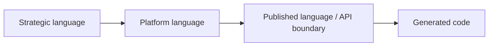
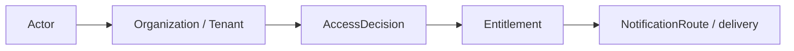
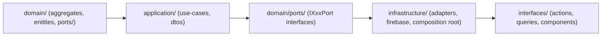

# Platform

本文件在本次任務限制下，僅依 Context7 驗證的 DDD、Context Map、Hexagonal Architecture 參考整理，不主張反映現況實作。

## Canonical Terms

| Term | Meaning |
|---|---|
| Actor | 被平台識別與治理的主體 |
| Identity | 證明 Actor 是誰的訊號集合 |
| Account | Actor 的帳號生命週期聚合根 |
| AccountProfile | 帳號附屬屬性與偏好 |
| Organization | 多主體治理邊界 |
| OrganizationTeam | Organization 邊界內的成員分組實體（內部/外部）。Team 是 OrganizationTeam 的縮寫，不代表獨立 Tenant。 |
| Tenant | 租戶隔離與 tenant-scoped 規則邊界 |
| AccessDecision | 對 actor 當下能否執行某行為的判定 |
| SecurityPolicy | 可版本化的安全規則集合 |
| FeatureFlag | 功能暴露與 rollout 的治理開關 |
| Entitlement | 綜合 subscription、policy、flag 之後的有效權益 |
| BillingEvent | 財務計價或收費事實 |
| Subscription | 方案、配額與續期狀態 |
| Consent | 同意、偏好與資料使用授權紀錄 |
| Secret | 受控憑證、token 或 integration credential |
| NotificationRoute | 訊息投遞路由與偏好結果 |
| AuditLog | 平台級永久稽核證據 |
| AccountScope | shell 上由 `accountId` 表示的帳號範疇，對應 `AccountType = "user" | "organization"` 所決定的 account context |
| PersonalAccount | 由單一 Actor 擁有、對應 `AccountType = "user"` 的 account scope |
| OrganizationAccount | 由 Organization 語意支撐、對應 `AccountType = "organization"` 的 account scope |

## Shell Surface Terms

| Term | Meaning |
|---|---|
| Account Catch-All Surface | `/{accountId}/[[...slug]]`，account-scoped shell composition contract |
| Flattened Governance Route | `/{accountId}/members`、`/{accountId}/teams`、`/{accountId}/permissions` 等 account-scoped governance URL |
| Legacy Organization Redirect Surface | `/{accountId}/organization/*` |

## Identifier Terms

| Identifier | Meaning |
|---|---|
| accountId | shell composition 的 account scope id；platform 以它選擇 personal account 或 organization account context |
| organizationId | organization aggregate、team、taxonomy、relations、ingestion 等 organization-scoped contract 所使用的 id |
| userId | 具體登入使用者或操作使用者的 id；用於 profile、createdByUserId、verifiedByUserId 等欄位 |
| actorId | 稽核、事件或 command metadata 中的行為主體 id；可能等於 userId，也可能是 system actor |
| tenantId | tenant isolation id；用於 tenant-scoped policy、storage、rules 與 observability isolation |

## Language Rules

- 使用 Actor，不使用 User 作為平台通用詞。`AccountType = "user"` 是 code-level string contract，代表「個人 Actor 帳號」，不等於 User 作為命名概念。
- 使用 Tenant 區分租戶隔離，不以 Organization 代替。
- 使用 OrganizationTeam 表示 Organization 邊界內的分組（縮寫為 Team 可接受）。Team 不代表獨立的 Tenant 或頂層治理邊界。
- 使用 Entitlement 表示解算後權益，不用 Plan 或 Feature 混稱。
- 使用 Consent 表示授權與同意，不用 Preference 混稱法律或治理語意。
- 使用 Secret 表示受控憑證，不放入一般 Integration payload 語言。
- Organization member 的移除操作使用 `removeMember`（通用）。`dismissPartnerMember` 僅限 external partner 場景，對應 DismissPartnerMember 使用案例。
- shell route 上的 `accountId` 表示 AccountScope，不等於 workspaceId。
- shell route 使用 `accountId`，不使用 `organizationId` 當 route param；organization-scoped model 需要時，再由 use case / mapper 顯式轉譯。
- `userId` 只表示具體使用者；`actorId` 表示行為主體，稽核與事件 metadata 可用 `actorId = "system"` 等非使用者值。
- `tenantId` 用於租戶隔離與 storage/rules path，不應與 `accountId` 或 `organizationId` 混成同一層 contract。
- `AccountType` 的 code-level literal 只使用 `"user" | "organization"`；顯示文字可寫個人帳號 / 組織帳號，但不把 `"personal"` 當成跨邊界字串值。
- account-scoped governance URL 採 flattened route，不再把 `/{accountId}/organization/*` 當成 canonical surface。

## Avoid

| Avoid | Use Instead |
|---|---|
| User | Actor |
| `AccountType = "personal"` | `AccountType = "user"` |
| `organizationId`（as shell route param） | `accountId` |
| `userId`（as audit / system actor id） | `actorId` |
| Team（as top-level Tenant） | Organization 或 Tenant |
| Team（as internal grouping） | OrganizationTeam（可縮寫 Team） |
| Plan Access | Entitlement |
| API Key Store | SecretManagement |
| `/{accountId}/organization/members` | `/{accountId}/members` |
| `/{accountId}/organization/teams` | `/{accountId}/teams` |
| `/{accountId}/organization/permissions` | `/{accountId}/permissions` |

## Naming Anti-Patterns

- 不用 User 混稱 Actor。
- 不用 Team 混稱 Organization 或 Tenant（分組含義的 Team = OrganizationTeam 可接受）。
- 不用 Plan 混稱 Entitlement。
- 不用 Preference 混稱 Consent。
- 不把 legacy organization route surface 當成 canonical account governance surface。

## AccountType String Values

`AccountType = "user" | "organization"` 是目前代碼、驗證與跨邊界 DTO 共用的字串契約：
- `"user"` → 代表個人 Actor 帳號（personal account），概念對應 Actor
- `"organization"` → 代表組織帳號，概念對應 Organization

命名上仍使用 Actor / Organization，不用 User 作為通用語言名詞。

## Copilot Generation Rules

- 生成程式碼時，名稱先對齊 Actor、Tenant、Entitlement、Consent、Secret，再決定類型與檔名。
- 奧卡姆剃刀：若一個治理名詞已足夠表達責任，就不要再堆疊第二個近義抽象名稱。
- 命名先保護治理語言，再考慮 UI 或 API 顯示便利。
- OrganizationTeam 相關程式碼放在 `modules/platform/subdomains/team/`，以 Team 縮寫命名可接受。

## Dependency Direction Flow

## Correct Interaction Flow

## Domain Layer Flow (enforced per subdomain)

## Document Network

- [README.md](./README.md)
- [AGENT.md](./AGENT.md)
- [subdomains.md](./subdomains.md)
- [bounded-contexts.md](./bounded-contexts.md)
- [../../ubiquitous-language.md](../../ubiquitous-language.md)
- [../../decisions/0004-ubiquitous-language.md](../../decisions/0004-ubiquitous-language.md)