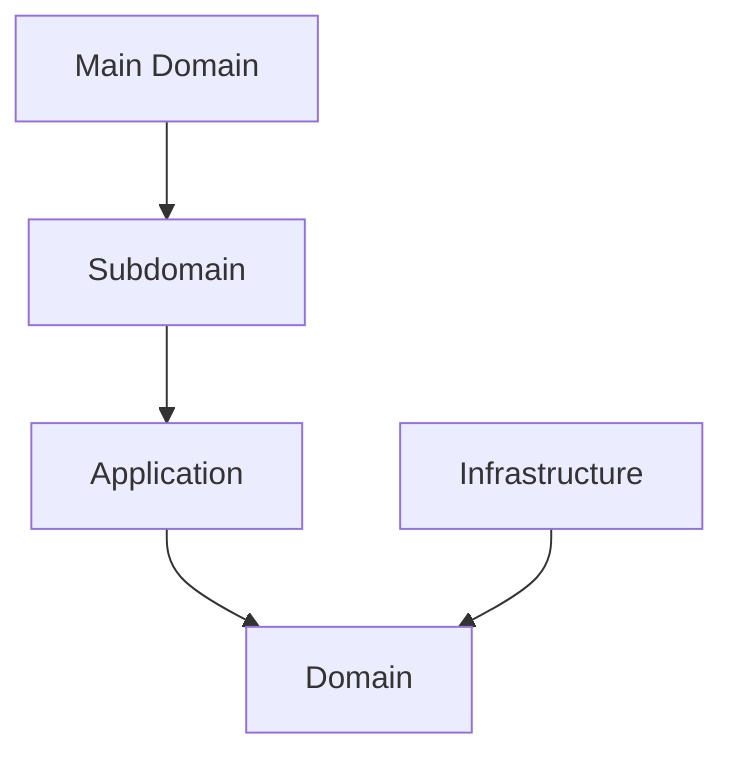
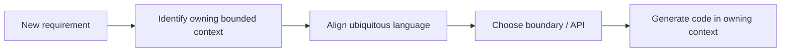

# 0002 Bounded Contexts

- Status: Accepted
- Date: 2026-04-11

## Context

Context7 驗證的 bounded context 原則要求每個 context 只承載一組高凝聚、可自洽的語言與規則。如果沒有清楚主域與子域所有權，術語、責任與整合規則就會互相覆蓋，造成治理語言、內容語言與推理語言混雜。

## Decision

將系統的主域固定為四個主域：

- workspace：協作容器與工作區範疇
- platform：治理、身份、權益與營運支撐
- notion：正典知識內容生命週期
- notebooklm：對話、來源處理與推理輸出

每個主域底下都有自己的子域集合。文件中必須明確區分：

- baseline subdomains：此架構基線中已確立的核心子域
- recommended gap subdomains：依 Context7 推導出的合理缺口子域

## Consequences

正面影響：

- 所有權清楚，可避免 platform、workspace、notion、notebooklm 互相吞邊界。
- 上層戰略文件與主域文件可共享同一個 decomposition 模型。

代價與限制：

- 需要承認 gap subdomains 是 architecture-first 建議，而不是 repo-inspected 現況事實。
- 未來若要改主域切分，必須連動更新 strategic docs、ADR 與 context docs。

## Conflict Resolution

- 若任何文件出現超過四個主域的平級切分，以本 ADR 為準並視為衝突。
- 若任何文件把 recommended gap subdomains 寫成已驗證現況，以本 ADR 為準並改回 architecture-first 表述。

## Rejected Anti-Patterns

- 讓多個主域同時聲稱同一正典所有權。
- 用 UI、部署或資料表分組來取代 bounded context 切分。
- 把 gap subdomain 寫成已落地事實，而不標示為架構缺口。

## Copilot Generation Rules

- 生成程式碼時，先判定需求屬於哪個主域與子域，再決定檔案位置與依賴方向。
- 奧卡姆剃刀：若既有 bounded context 已可吸收需求，就不要新增平級主域或語意重疊子域。
- 所有權不清楚時，先修正語言與 context map，再寫程式碼。

## Dependency Direction Flow

## Correct Interaction Flow

## Document Network

- [README.md](./README.md)
- [0001-hexagonal-architecture.md](./0001-hexagonal-architecture.md)
- [0003-context-map.md](./0003-context-map.md)
- [../bounded-contexts.md](../bounded-contexts.md)
- [../subdomains.md](../subdomains.md)
- [../bounded-context-subdomain-template.md](../bounded-context-subdomain-template.md)
- [../project-delivery-milestones.md](../project-delivery-milestones.md)