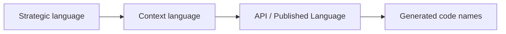
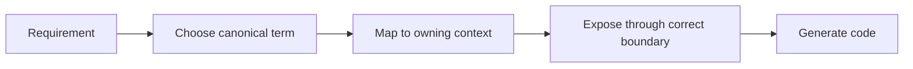

# 0004 Ubiquitous Language

- Status: Accepted
- Date: 2026-04-11

## Context

Context7 驗證的 DDD 參考指出，領域核心必須運作在自己清楚的 ubiquitous language 之上。若沒有共同語言，跨主域整合、ADR、戰略文件與子域文件會用不同詞指同一件事，或用同一詞指不同責任，進而造成長期衝突。

## Decision

建立兩層語言治理：

- strategic ubiquitous language：定義四主域共用的戰略術語與整合術語
- context-specific ubiquitous language：由各主域 context 文件定義更細的本地主域語言

主域層的關鍵術語固定為：

- platform：Actor、Tenant、Entitlement、Secret、Consent
- workspace：Workspace、Membership、ShareScope、ActivityFeed、AuditTrail
- notion：KnowledgeArtifact、Taxonomy、Relation、Publication
- notebooklm：Notebook、Ingestion、Retrieval、Grounding、Synthesis、Evaluation

## Consequences

正面影響：

- 戰略文件、主域文件與 ADR 可以共享同一套術語。
- 語言衝突可以在文件層面先被攔住，而不是等到實作才暴露。

代價與限制：

- 命名自由度下降，需要持續維護 glossary。
- 新概念若無法歸屬到既有語言，必須先做文件決策。

## Conflict Resolution

- 若戰略語言與主域語言衝突，先以更具邊界意義的主域語言為準，再回寫 strategic glossary。
- 若兩個主域同時主張同一術語所有權，以 bounded contexts 與 context map 的所有權關係為準。

## Rejected Anti-Patterns

- 用同一個詞同時指涉治理、內容、推理三種不同責任。
- 用舊產品術語覆蓋新的 bounded context 語言。
- 讓實作便利性凌駕於 ubiquitous language 一致性。

## Copilot Generation Rules

- 生成程式碼時，先對齊 strategic term 與 context-specific term，再決定檔名、型別與 API 名稱。
- 奧卡姆剃刀：若一個名詞已足夠表達邊界，就不要再堆疊第二個近義抽象詞。
- 名稱若與現有語言衝突，先修正文檔與用語，再寫程式碼。

## Dependency Direction Flow

## Correct Interaction Flow

## Document Network

- [README.md](./README.md)
- [0002-bounded-contexts.md](./0002-bounded-contexts.md)
- [../ubiquitous-language.md](../ubiquitous-language.md)
- [../contexts/_template.md](../contexts/_template.md)
- [../bounded-context-subdomain-template.md](../bounded-context-subdomain-template.md)
- [../project-delivery-milestones.md](../project-delivery-milestones.md)