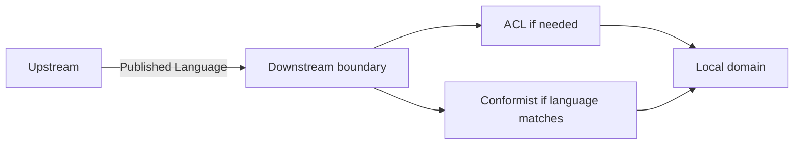
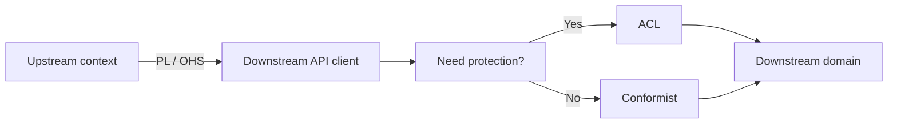

# 0005 Anti-Corruption Layer

- Status: Accepted
- Date: 2026-04-11

## Context

Context Mapper 明確指出 ACL 只能出現在 upstream-downstream 關係中，且只能由 downstream 採用；ACL 與 Conformist 互斥，且都不適用於 Shared Kernel 或 Partnership。若沒有這條規則，整合文件會同時宣稱保護語言與直接順從上游，造成自相矛盾。

## Decision

採用以下整合保護規則：

- 主域級整合預設先使用 published language + local DTO。
- 若上游語言會扭曲下游語言，下游必須使用 ACL。
- 若上游語言與下游需求高度一致，下游才可選擇 Conformist。
- ACL 與 Conformist 不能同時套用在同一關係。
- 因本架構基線不採用主域級 Shared Kernel / Partnership，所以主域級不允許以對稱關係為由略過 ACL 判斷。

## Consequences

正面影響：

- 下游主域可以保護自己的 ubiquitous language。
- Integration guidelines 可以有單一、可判斷的模式選擇規則。

代價與限制：

- 需要維護更多轉譯器、Local DTO 與邊界測試。
- 若每個整合都無條件使用 ACL，也會增加樣板成本，因此仍須做必要性判斷。

## Conflict Resolution

- 若任何文件把 ACL 寫成 upstream 的責任，判定為衝突，以本 ADR 為準。
- 若任何文件同時要求 ACL 與 Conformist 套在同一整合，判定為衝突，以本 ADR 為準。
- 若任何文件在對稱關係上使用 ACL / Conformist，判定為衝突，以本 ADR 為準。

## Rejected Anti-Patterns

- 把 ACL 當成 upstream 的工作。
- 在同一關係同時宣稱 ACL 與 Conformist。
- 用 Shared Kernel / Partnership 當理由跳過整合語義判斷。

## Copilot Generation Rules

- 生成程式碼時，先確認自己是 upstream 還是 downstream，再決定是否需要 ACL 或 Conformist。
- 奧卡姆剃刀：若 published language 加 local DTO 已足夠，就不要額外新增第二層 ACL。
- 只有在上游語言真的會污染本地語言時，才建立 ACL。

## Dependency Direction Flow

## Correct Interaction Flow

## Document Network

- [README.md](./README.md)
- [0003-context-map.md](./0003-context-map.md)
- [../context-map.md](../context-map.md)
- [../integration-guidelines.md](../integration-guidelines.md)
- [../bounded-context-subdomain-template.md](../bounded-context-subdomain-template.md)
- [../project-delivery-milestones.md](../project-delivery-milestones.md)