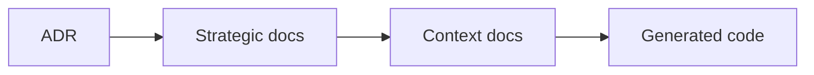
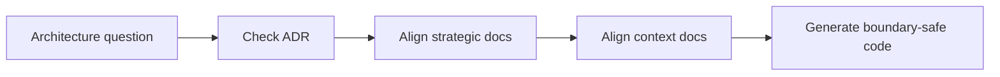

# Decisions

本目錄是 architecture-first 的決策日誌。依 ADR 參考模式，每份 ADR 至少說明 context、decision、consequences 與 conflict resolution，讓後續戰略文件可以引用相同決策來源。

## Decision Log

| ADR | Title | Status | Scope |
|---|---|---|---|
| [0001-hexagonal-architecture.md](./0001-hexagonal-architecture.md) | Hexagonal Architecture | Accepted | 全域架構與邊界分層 |
| [0002-bounded-contexts.md](./0002-bounded-contexts.md) | Bounded Contexts | Accepted | 舊四主域 baseline，若衝突由 0014 補正 |
| [0003-context-map.md](./0003-context-map.md) | Context Map | Accepted | 舊主域依賴方向 baseline，若衝突由 0014 補正 |
| [0004-ubiquitous-language.md](./0004-ubiquitous-language.md) | Ubiquitous Language | Accepted | 戰略術語治理 |
| [0005-anti-corruption-layer.md](./0005-anti-corruption-layer.md) | Anti-Corruption Layer | Accepted | 邊界整合保護規則 |
| [0006-domain-event-discriminant-format.md](./0006-domain-event-discriminant-format.md) | Domain Event Discriminant Format | Accepted | 83 snake_case + 4 missing prefix + 25 wrong module prefix violations |
| [0007-infrastructure-in-api-layer.md](./0007-infrastructure-in-api-layer.md) | Infrastructure Wiring in api/ Layer | Accepted | workspace & platform api/ 層直接實例化 Firebase 適配器（10 檔、28 處）|
| [0008-repository-interface-placement.md](./0008-repository-interface-placement.md) | Repository Interface Placement | Accepted | domain/repositories/ vs domain/ports/ 混用（23+24 個子域）|
| [0009-anemic-aggregates.md](./0009-anemic-aggregates.md) | Anemic Aggregates | Accepted | 11 個 domain/aggregates/ 文件只含 interface/type，無 class 與業務行為 |
| [0010-aggregate-domain-event-emission.md](./0010-aggregate-domain-event-emission.md) | Aggregate Domain Event Emission | Accepted | 2 個 class 聚合根缺少 pullDomainEvents；Workspace 事件在 use-case 中手動組裝 |
| [0011-use-case-bundling.md](./0011-use-case-bundling.md) | Use Case Bundling and Query-Command Mixing | Accepted | 30 個多類別 use-case 捆綁文件；8 處命令文件 re-export 查詢類別 |
| [0012-source-to-task-orchestration.md](./0012-source-to-task-orchestration.md) | Source-To-Task Orchestration | Accepted | upload → parse → Knowledge Page → task 的跨 context 邊界與 orchestration 決策 |
| [0014-main-domain-resplit.md](./0014-main-domain-resplit.md) | Main Domain Resplit | Accepted | 八主域重切與 ownership baseline 更新 |

## Design Smell Taxonomy (1000–5200)

完整編號體系請見 [SMELL-INDEX.md](./SMELL-INDEX.md)。

| ID | Title | Category | Status |
|----|-------|----------|--------|
| [1100](./1100-layer-violation.md) | Layer Violation | Architectural | Accepted |
| [1200](./1200-boundary-violation.md) | Boundary Violation | Architectural | Accepted |
| [1300](./1300-cyclic-dependency.md) | Cyclic Dependency | Architectural | Accepted |
| [1400](./1400-dependency-leakage.md) | Dependency Leakage | Architectural | Accepted |
| [2100](./2100-tight-coupling.md) | Tight Coupling | Coupling | Accepted |
| [2200](./2200-hidden-coupling.md) | Hidden Coupling | Coupling | Accepted |
| [2300](./2300-temporal-coupling.md) | Temporal Coupling | Coupling | Accepted |
| [3100](./3100-low-cohesion.md) | Low Cohesion | Modularity | Accepted |
| [3200](./3200-duplication.md) | Duplication | Modularity | Accepted |
| [4100](./4100-change-amplification.md) | Change Amplification | Maintainability | Accepted |
| [4200](./4200-inconsistency.md) | Inconsistency | Maintainability | Accepted |
| [4300](./4300-semantic-drift.md) | Semantic Drift | Maintainability | Accepted |
| [5100](./5100-accidental-complexity.md) | Accidental Complexity | Complexity | Accepted |
| [5200](./5200-cognitive-load.md) | Cognitive Load | Complexity | Accepted |

## How To Use This Directory

- 先讀標題以取得整體脈絡。
- 若某份戰略文件與 ADR 衝突，以 ADR 的 decision 與 conflict resolution 為準。
- 若未來新增新的架構決策，應沿用同一結構補充，而不是覆寫舊決策歷史。
- Design Smell ADR（1000–5200）記錄具體 smell 的 context + evidence + decision；遇到對應 smell 時先查此表再動手。

## Lint Signal Mapping

下列 smell 有對應的 ESLint warning-level signal。lint 只負責早期暴露壓力，不自動等於完整語意判決。

| Smell ADR | Lint Signal | Enforcement Target |
|---|---|---|
| 1300 Cyclic Dependency | `no-restricted-syntax` 禁止 `require()` | `modules/**/*.{ts,tsx,js,jsx}` |
| 1400 Dependency Leakage | `no-restricted-syntax` 禁止 `api/index.ts` wildcard re-export `../application` / `../interfaces` | `modules/**/api/**/*.ts` |
| 3100 Low Cohesion | `max-lines` 預警 API surface 過胖 | `modules/*/api/**/*.{ts,tsx,js,jsx}` |
| 5200 Cognitive Load | `max-lines` 預警 fat screen | `modules/*/**/interfaces/**/components/screens/**/*.{ts,tsx}` |

- 若 lint warning 指向上述 smell，先回到對應 smell ADR 看 decision 與 conflict resolution，再決定是拆分、降 surface、還是保留臨時例外。
- 若某個 smell 目前無法由 lint 穩定表達，文件判準仍優先於方便但粗糙的 regex 規則。

## Anti-Pattern Coverage

- 0001 禁止把 framework / infrastructure 滲入核心。
- 0002 禁止主域與子域所有權漂移。
- 0003 禁止上下游方向與對稱關係混寫。
- 0004 禁止語言污染與同詞多義。
- 0005 禁止錯置 ACL / Conformist 的責任位置。
- 0006 禁止 domain event discriminant 使用 snake_case、缺少主域前綴、或使用縮寫模組名稱。
- 0007 禁止在 api/ 層持有 infrastructure singleton 或 Firebase 適配器實例化。
- 0008 禁止在 api/ 或 application/ 定義 inline port interface；repository 與 non-repository port 應分別放入 domain/repositories/ 與 domain/ports/。
- 0009 禁止在 domain/aggregates/ 放只含 interface/type 的文件；aggregates/ 只放 class，純資料快照移至 entities/ 或與 class 共置。
- 0010 禁止在 use-case 中手動組裝 aggregate 領域事件；聚合根必須實作 _domainEvents 陣列與 pullDomainEvents()，use-case 只在持久化後提取。
- 0011 禁止在一個 use-case 文件中捆綁多個 class；禁止命令 use-case 文件 re-export 查詢類別（GetXxx/ListXxx 屬 application/queries/）。
- 1100 禁止 interfaces/ 下建立 api/ 子目錄；api/ 層禁止直接 import Firebase SDK（應透過 @integration-firebase adapter）。
- 1200 禁止 api/ 邊界暴露 UI 元件或 React hooks；跨模組能力合約只含 use-case、service interface、DTO types。
- 1300 禁止主域間直接循環依賴；intra-subdomain 循環必須透過 Port + DI 解決，`require()` 延遲載入只作臨時補丁並標注 TODO。
- 1400 禁止 `export * from "../application"` 或 `export * from "../interfaces"` 在 api/index.ts 中使用；只精確 export 公開能力合約符號。
- 2100 禁止消費者無差別 import `platform/api` 整體；應從精確子域路徑或分離的 api/ui.ts 取用。
- 2200 禁止在 application/ 層或 server action 文件中持有 module-level `let _xxx` singleton；singleton 只允許在 interfaces/composition/ 中。
- 2300 禁止隱式初始化順序依賴；延遲初始化前提條件必須在型別（Promise、factory）中顯式表達。
- 3100 禁止 api/index.ts 混合基礎設施 API、服務 API、UI 元件、hooks；各職責應分離至獨立文件。
- 3200 禁止混用 dto/dtos 目錄命名；統一使用 dto（單數）；use-case 文件統一放入 use-cases/ 子目錄。
- 4100 禁止 platform/api 作為單一 monolithic 依賴點；精確子域 import 降低變更放大範圍。
- 4200 禁止不一致的目錄命名（dto/dtos）和 queries/ 歸屬；統一規則記錄於模組 instructions 中。
- 4300 禁止 interfaces/ 內嵌 api/ 子目錄；禁止 application/ 持有 event-mappers/（屬 infrastructure）；handlers/ 必須有明確語意名稱。
- 5100 禁止在 api/ 層製造超過必要數量的文件；workspace/api contracts.ts 與 facade.ts 應合併；infrastructure-api.ts 長期移至 infrastructure/。
- 5200 路徑深度上限 10 層；platform/application/ 子目錄控制在 4 個以內；platform/api/ 文件精簡至 3 個。

## Copilot Generation Rules

- 生成程式碼前，先由 ADR 決定邊界、語言與整合責任，再下手實作。
- 奧卡姆剃刀：若既有 ADR 已能解決當前判斷，就不要再堆疊新的臨時規則文件。
- 新規則若會改變邊界，先補 ADR，再補戰略文件與 context docs。

## Dependency Direction Flow

## Correct Interaction Flow

## Document Network

- [0001-hexagonal-architecture.md](./0001-hexagonal-architecture.md)
- [0002-bounded-contexts.md](./0002-bounded-contexts.md)
- [0003-context-map.md](./0003-context-map.md)
- [0004-ubiquitous-language.md](./0004-ubiquitous-language.md)
- [0005-anti-corruption-layer.md](./0005-anti-corruption-layer.md)
- [0006-domain-event-discriminant-format.md](./0006-domain-event-discriminant-format.md)
- [0007-infrastructure-in-api-layer.md](./0007-infrastructure-in-api-layer.md)
- [0008-repository-interface-placement.md](./0008-repository-interface-placement.md)
- [0009-anemic-aggregates.md](./0009-anemic-aggregates.md)
- [0010-aggregate-domain-event-emission.md](./0010-aggregate-domain-event-emission.md)
- [0011-use-case-bundling.md](./0011-use-case-bundling.md)
- [SMELL-INDEX.md](./SMELL-INDEX.md) ← Design Smell Taxonomy Index
- [1100-layer-violation.md](./1100-layer-violation.md)
- [1200-boundary-violation.md](./1200-boundary-violation.md)
- [1300-cyclic-dependency.md](./1300-cyclic-dependency.md)
- [1400-dependency-leakage.md](./1400-dependency-leakage.md)
- [2100-tight-coupling.md](./2100-tight-coupling.md)
- [2200-hidden-coupling.md](./2200-hidden-coupling.md)
- [2300-temporal-coupling.md](./2300-temporal-coupling.md)
- [3100-low-cohesion.md](./3100-low-cohesion.md)
- [3200-duplication.md](./3200-duplication.md)
- [4100-change-amplification.md](./4100-change-amplification.md)
- [4200-inconsistency.md](./4200-inconsistency.md)
- [4300-semantic-drift.md](./4300-semantic-drift.md)
- [5100-accidental-complexity.md](./5100-accidental-complexity.md)
- [5200-cognitive-load.md](./5200-cognitive-load.md)
- [../bounded-context-subdomain-template.md](../bounded-context-subdomain-template.md)
- [../project-delivery-milestones.md](../project-delivery-milestones.md)
- [../README.md](../README.md)

## Constraints

- 本目錄在本次任務限制下，只依 Context7 架構參考重建。
- 本目錄不是對既有 repo 內容做過語意比對後的歷史還原。