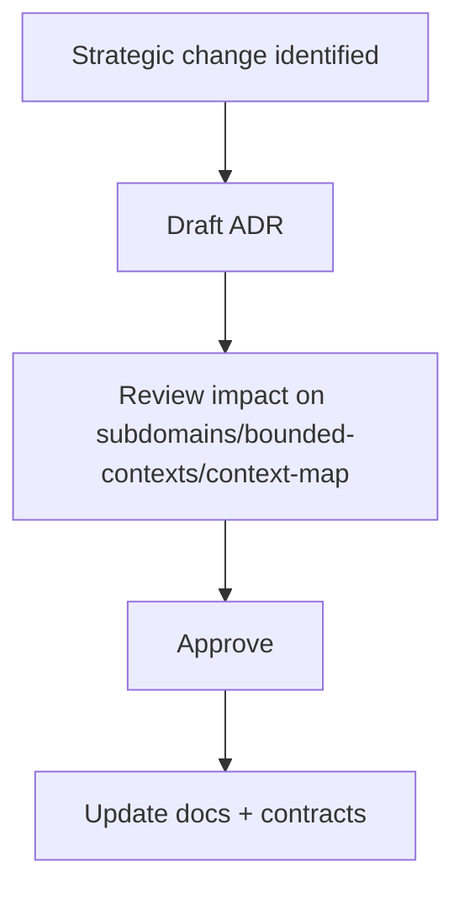

# Strategic ADR Index

## ADR Flow

## Rules

1. Every strategic boundary change requires an ADR.
2. ADR must list affected contexts and published language contracts.
3. ADR status must be one of: Proposed, Accepted, Superseded.

