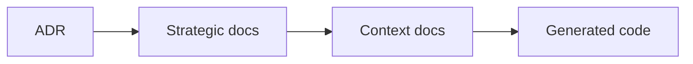
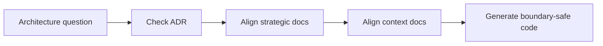

# Decisions

本目錄是 architecture-first 的決策日誌。依 ADR 參考模式，每份 ADR 至少說明 context、decision、consequences 與 conflict resolution，讓後續戰略文件可以引用相同決策來源。

## Decision Log

| ADR | Title | Status | Scope |
|---|---|---|---|
| [0001-hexagonal-architecture.md](./0001-hexagonal-architecture.md) | Hexagonal Architecture | Accepted | 全域架構與邊界分層 |
| [0002-bounded-contexts.md](./0002-bounded-contexts.md) | Bounded Contexts | Accepted | 四主域與子域切分 |
| [0003-context-map.md](./0003-context-map.md) | Context Map | Accepted | 主域間依賴方向 |
| [0004-ubiquitous-language.md](./0004-ubiquitous-language.md) | Ubiquitous Language | Accepted | 戰略術語治理 |
| [0005-anti-corruption-layer.md](./0005-anti-corruption-layer.md) | Anti-Corruption Layer | Accepted | 邊界整合保護規則 |
| [0006-domain-event-discriminant-format.md](./0006-domain-event-discriminant-format.md) | Domain Event Discriminant Format | Accepted | 83 snake_case + 4 missing prefix + 25 wrong module prefix violations |
| [0007-infrastructure-in-api-layer.md](./0007-infrastructure-in-api-layer.md) | Infrastructure Wiring in api/ Layer | Accepted | workspace & platform api/ 層直接實例化 Firebase 適配器（10 檔、28 處）|
| [0008-repository-interface-placement.md](./0008-repository-interface-placement.md) | Repository Interface Placement | Accepted | domain/repositories/ vs domain/ports/ 混用（23+24 個子域）|

## How To Use This Directory

- 先讀標題以取得整體脈絡。
- 若某份戰略文件與 ADR 衝突，以 ADR 的 decision 與 conflict resolution 為準。
- 若未來新增新的架構決策，應沿用同一結構補充，而不是覆寫舊決策歷史。

## Anti-Pattern Coverage

- 0001 禁止把 framework / infrastructure 滲入核心。
- 0002 禁止主域與子域所有權漂移。
- 0003 禁止上下游方向與對稱關係混寫。
- 0004 禁止語言污染與同詞多義。
- 0005 禁止錯置 ACL / Conformist 的責任位置。
- 0006 禁止 domain event discriminant 使用 snake_case、缺少主域前綴、或使用縮寫模組名稱。
- 0007 禁止在 api/ 層持有 infrastructure singleton 或 Firebase 適配器實例化。
- 0008 禁止在 api/ 或 application/ 定義 inline port interface；repository 與 non-repository port 應分別放入 domain/repositories/ 與 domain/ports/。

## Copilot Generation Rules

- 生成程式碼前，先由 ADR 決定邊界、語言與整合責任，再下手實作。
- 奧卡姆剃刀：若既有 ADR 已能解決當前判斷，就不要再堆疊新的臨時規則文件。
- 新規則若會改變邊界，先補 ADR，再補戰略文件與 context docs。

## Dependency Direction Flow

## Correct Interaction Flow

## Document Network

- [0001-hexagonal-architecture.md](./0001-hexagonal-architecture.md)
- [0002-bounded-contexts.md](./0002-bounded-contexts.md)
- [0003-context-map.md](./0003-context-map.md)
- [0004-ubiquitous-language.md](./0004-ubiquitous-language.md)
- [0005-anti-corruption-layer.md](./0005-anti-corruption-layer.md)
- [0006-domain-event-discriminant-format.md](./0006-domain-event-discriminant-format.md)
- [0007-infrastructure-in-api-layer.md](./0007-infrastructure-in-api-layer.md)
- [0008-repository-interface-placement.md](./0008-repository-interface-placement.md)
- [../bounded-context-subdomain-template.md](../bounded-context-subdomain-template.md)
- [../project-delivery-milestones.md](../project-delivery-milestones.md)
- [../README.md](../README.md)

## Constraints

- 本目錄在本次任務限制下，只依 Context7 架構參考重建。
- 本目錄不是對既有 repo 內容做過語意比對後的歷史還原。