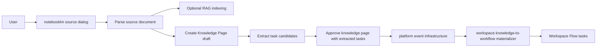

# Upload → Parse → Knowledge Page → Task Flow Delivery

## Delivery Scope

這份 delivery 文件描述跨 context 的完整 handoff 流程，目標是把現有的：

`Upload → Parse → Knowledge Page`

擴充為：

`Upload → Parse → Knowledge Page → Tasks`

且在整個串接過程中維持 platform / notebooklm / notion / workspace 的責任邊界清楚。

## End-to-End Flow

## Responsibility Handoff Table

| Step | Owner | Responsibility | Output |
|---|---|---|---|
| Upload / options | `notebooklm.source.interfaces` | 收集使用者選項與啟動 workflow | processing request |
| Parse | `notebooklm.source.application` + pipeline port | 呼叫解析流程並等待結果 | parsed JSON + page count |
| RAG | `notebooklm.source.application` | 選擇性建立索引 | chunks / vectors |
| Draft page | `notion.knowledge` | 建立正典 Knowledge Page 草稿 | `pageId` |
| Candidate extraction | `workspace.task-formation` public API | 從 parsed blocks 抽取候選任務 | extracted tasks |
| Approval / publish | `notion` + `platform` event infra | 透過公開能力與事件 transport 交接 | approved page event |
| Materialization | `workspace.task-formation` listener | 將 extracted tasks 落地為 workspace tasks | workflow tasks |

## Compliance Rules Applied

1. **Platform owns event transport**
   - 事件基礎設施由 platform server-side composition 建立。
2. **NotebookLM owns orchestration only**
   - notebooklm 不直接寫 task repository。
3. **Notion remains canonical content owner**
   - 任務流程先經過 Knowledge Page，不跳過正典內容邊界。
4. **Workspace owns task materialization**
   - 真正的 task 落地由 workspace.task-formation 處理。
5. **Cross-context collaboration uses public API or events only**
   - 不直接 import 他域的 `domain/` 或 `application/` internals。

## Operational Outcome

交付後，使用者在同一個處理對話框中就能看見：

- 文件解析結果
- RAG 結果
- Knowledge Page 狀態
- 任務流程狀態
- 前往 Knowledge Page 的連結
- 前往 Tasks 的連結

## Validation Evidence

本次交付已通過下列驗證：

- source workflow regression test：passed
- Next.js production build：passed
- lint：0 errors（僅保留 repo 既有 warnings）
- browser load check：passed

## Delivery Summary

這次交付不是新增一條繞路流程，而是把既有的知識頁流程，**向下安全延伸到 workspace 任務流程**，並保留事件驅動與 public API 的合規結構。