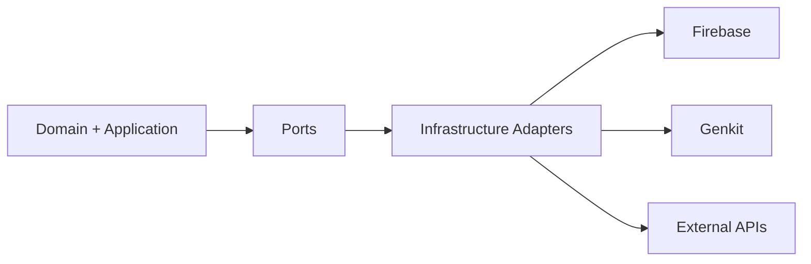

# Integration Guidelines

## Integration Topology

## Rules (Firebase / Genkit / External APIs)

1. Domain must not depend on Firebase/Genkit SDKs directly.
2. External contracts are translated in adapters, not in domain entities.
3. Integration failures are surfaced explicitly; no silent fallback behavior.
4. Version and deprecation risks must be documented in ADRs.
5. Cross-context data exchange uses published language, never raw external payloads.

