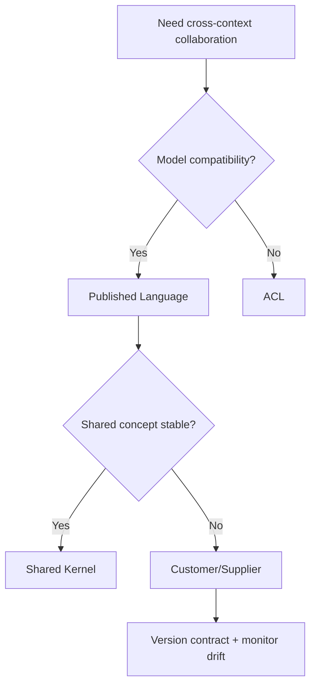

# Strategic Patterns

## Pattern Flow

## Pattern Rules

1. Prefer **Published Language** for explicit contracts.
2. Use **ACL** when upstream/downstream models diverge.
3. Use **Shared Kernel** only for low-volatility, jointly-owned concepts.
4. Use **Open Host Service** for reusable external-facing integration contracts.
5. Apply **Conformist** only with explicit risk acceptance.

