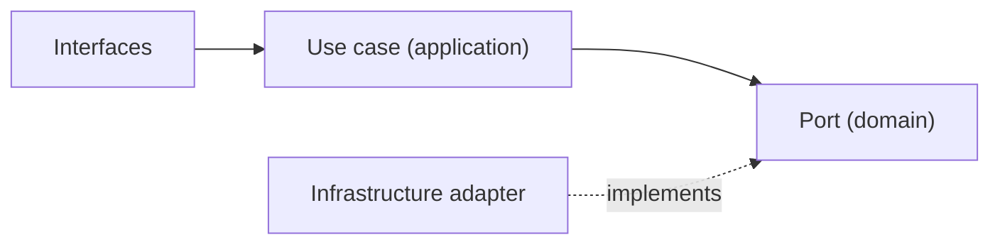
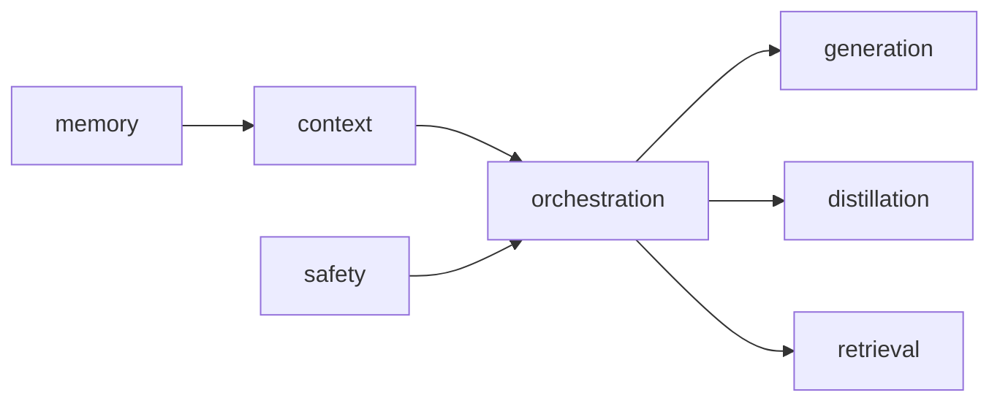

# AI Subdomains

## Baseline Subdomains

| Subdomain | Responsibility |
|---|---|
| generation | 文字生成；Genkit 接縫；`generateText`、`summarize` |
| orchestration | 執行圖與多步驟 AI workflow 協調 |
| distillation | 將長輸出或多來源濃縮為精煉知識片段 |
| retrieval | 向量搜尋、相似度查詢與上下文抓取 |
| memory | 對話歷史與跨輪次狀態保存 |
| context | prompt 上下文組裝與 token 預算管理 |
| safety | 安全護欄、有害內容過濾與合規保護 |
| tool-calling | 外部工具調用協調與結果回注 |
| reasoning | 推理步驟管理（chain-of-thought、反思） |
| conversation | AI 互動輪次追蹤與歷史管理 |
| evaluation | 輸出品質評估與回歸基準 |
| tracing | AI 執行觀測、span 紀錄與成本追蹤 |

## Subdomain Groupings

| Group | Subdomains |
|---|---|
| Core Execution | generation、orchestration、distillation |
| Knowledge Access | retrieval、memory、context |
| Quality & Safety | safety、evaluation、tracing |
| Extended Capability | tool-calling、reasoning、conversation |

## Recommended Gap Subdomains

| Subdomain | 功能註解 |
|---|---|
| provider-routing | 模型供應商選擇與路由治理 |
| model-policy | 模型能力、版本與使用政策 |

- generation 子域已有 Genkit 實作（`GenkitAiTextGenerationAdapter`）。
- 其餘子域為骨架狀態，依需求逐步實作。

## Distillation 說明

distillation 將多段 AI 輸出或長文濃縮為精煉、可引用的知識片段，與 generation 的差異在於：

- generation：輸入 prompt → 輸出文字。
- distillation：輸入多段內容 → 輸出 overview、highlights 與其他 schema-ready knowledge fragments。

下游（如 notebooklm）消費 distillation 能力，但 distillation 的輸出語義屬於 ai，不屬於 notebooklm 的推理輸出。

### Distilled Rules

- distillation 應被視為 knowledge compiler，而不是只做單一 summary 字串回傳。
- memory 應優先吸收 distilled output，避免 raw content 直接放大 token 與成本。
- retrieval 若可選擇資料來源，應優先使用 distilled chunks 或 structured knowledge signal。
- evaluation 應把 distillation 視為正式品質對象，至少檢查 compression、retention 與 hallucination 風險。
- 大型蒸餾流程應優先走 async pipeline，而不是把重工作壓在同步入口。

## Anti-Patterns

- 不把 distillation 子域當成 notebooklm 的 synthesis 子域的替代品；兩者語義不同。
- 不把 retrieval 混成 notion 的知識查詢；ai retrieval 是通用向量能力。
- 不把 conversation 子域等同 notebooklm 的 Conversation aggregate。
- 不在 subdomain domain 層 import 任何 LLM SDK 或 Firebase 相關依賴。

## Copilot Generation Rules

- 新 AI use case 先對應到上表某個子域，再決定 port 位置與 adapter 實作。
- 若 distillation 只是 summarize 的變體，先在 generation 子域新增 use case，確認不夠後才升至 distillation 子域。
- 奧卡姆剃刀：子域骨架存在不代表需要立即填滿所有層；按需實作。

## Dependency Direction Flow

## Correct Subdomain Interaction

## Document Network

- [README.md](./README.md)
- [bounded-contexts.md](./bounded-contexts.md)
- [context-map.md](./context-map.md)
- [ubiquitous-language.md](./ubiquitous-language.md)
- [subdomains.md](../domain/subdomains.md)
