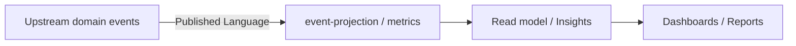

# Analytics Context — Agent Guide

本文件在本次任務限制下，僅依 Context7 驗證的 DDD、Context Map、Hexagonal Architecture 參考整理，不主張反映現況實作。

## Mission

保護 analytics 主域作為下游投影與指標主域。任何變更都應維持 analytics 消費上游事件後形成 read model，而不是反向成為正典 aggregate 的持有者。

## Canonical Ownership

- reporting（報表輸出）
- metrics（指標定義與聚合）
- dashboards（儀表板語義）
- telemetry-projection（事件投影 / read model 匯總）
- experimentation（A/B 測試分析，gap subdomain）
- decision-support（決策輔助輸出，gap subdomain）

> **實作層命名備注：** `src/modules/analytics/` 以 `event-contracts`、`event-ingestion`、`event-projection`、`insights`、`metrics`、`realtime-insights` 作為子域目錄名稱。
> 這些是技術操作名稱；`event-projection` 對應戰略層 `telemetry-projection`，`insights` 對應 `reporting`，`realtime-insights` 對應儀表板能力。

## Route Here When

- 問題核心是事件投影、指標計算、洞察報表或分析儀表板。
- 問題需要把上游業務事件轉成下游 read model 或分析視圖。

## Route Elsewhere When

- 業務事件的發出方屬於各自的上游主域（iam、billing、workspace、notion、notebooklm）。
- AI 生成能力屬於 ai context；不要讓 analytics 擁有 AI capability。
- 平台觀測（健康量測、告警、追蹤）屬於 platform.observability。

## Guardrails

- analytics 是下游投影，不直接持有上游 aggregate 的寫入正典。
- event projection 的 read model 不得反向改寫上游狀態。
- analytics 消費 published language tokens（domain event），不暴露上游 aggregate 完整模型。
- 跨主域互動只經過 published language、API 邊界或事件。

## Hard Prohibitions

- ❌ 讓 analytics 成為上游 iam / billing / workspace / notion 的正典模型持有者。
- ❌ 在 domain/ 匯入 Firebase SDK、React 或任何框架。
- ❌ 讓 analytics 反向呼叫上游主域的寫入 API（analytics 是 sink，不是 source）。

## Copilot Generation Rules

- 生成程式碼時，先確認需求是投影、指標還是報表，再決定子域。
- 奧卡姆剃刀：能用事件投影解決的分析需求，不要另建寫入 aggregate。

## Dependency Direction Flow

## Document Network

- [README.md](./README.md)
- [bounded-contexts.md](./bounded-contexts.md)
- [context-map.md](./context-map.md)
- [subdomains.md](./subdomains.md)
- [ubiquitous-language.md](./ubiquitous-language.md)
- 
        param($m)
        $dir = $m.Groups[1].Value
        $file = $m.Groups[2].Value
        "[$file](../../$dir/$file)"
    
- 
        param($m)
        $dir = $m.Groups[1].Value
        $file = $m.Groups[2].Value
        "[$file](../../$dir/$file)"
    
- 
        param($m)
        $dir = $m.Groups[1].Value
        $file = $m.Groups[2].Value
        "[$file](../../$dir/$file)"
    
