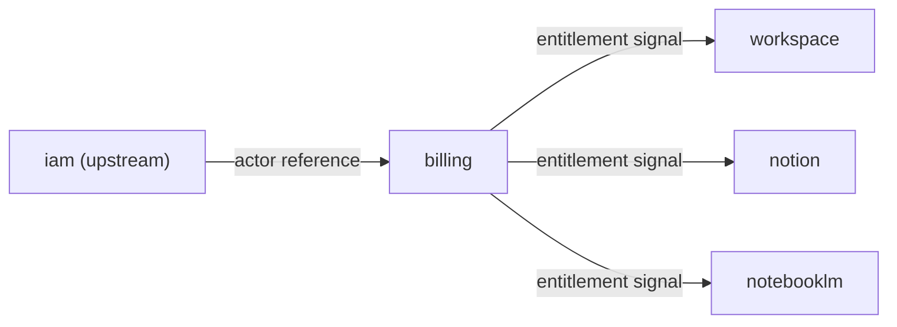

# Billing Context — Agent Guide

本文件在本次任務限制下，僅依 Context7 驗證的 DDD、Context Map、Hexagonal Architecture 參考整理，不主張反映現況實作。

## Mission

保護 billing 主域作為商業生命週期的正典所有者。任何新功能都應先問：這是計費、訂閱、授權還是推薦的正典能力？若是，屬 billing；若只是消費授權信號，屬下游主域。

## Canonical Ownership

- billing（計費狀態、費率、財務證據）
- subscription（方案、配額、續期治理）
- entitlement（有效權益與功能可用性）
- referral（推薦關係與獎勵追蹤）
- pricing（方案矩陣，gap subdomain）
- invoice（帳單對帳，gap subdomain）
- quota-policy（商業限制規則，gap subdomain）

> **實作層備注：** `src/modules/billing/` 另有 `usage-metering` 子域，作為計量用量的實作邊界，對應戰略層的 quota-policy 能力。

## Route Here When

- 問題核心是訂閱方案、權益解算、計費狀態或推薦追蹤。
- 問題需要決定某個功能是否可用（entitlement）。

## Route Elsewhere When

- 使用者身份治理屬於 iam。
- 工作區或知識內容的可見性規則屬於 workspace 或 notion。
- AI 模型使用政策屬於 ai；不要讓 billing 擁有 AI capability policy。

## Guardrails

- 下游主域只消費 `entitlement signal`（能力是否可用），不持有 billing aggregate 完整模型。
- 不在 billing domain/ 匯入身份治理或內容模型。
- 跨主域互動只經由 published language tokens。

## Hard Prohibitions

- ❌ 讓 billing 持有 Actor / Identity / Tenant 模型（屬 iam）。
- ❌ 讓 billing 擁有 AI 使用政策（屬 ai）。
- ❌ 在 domain/ 匯入 Firebase SDK、React 或任何框架。

## Copilot Generation Rules

- 生成程式碼時，先確認需求是計費、訂閱、授權還是計量，再決定子域。
- 奧卡姆剃刀：若能用 entitlement signal 解決下游問題，不要讓下游擁有 billing 正典。

## Dependency Direction Flow

## Document Network

- [README.md](./README.md)
- [bounded-contexts.md](./bounded-contexts.md)
- [context-map.md](./context-map.md)
- [subdomains.md](./subdomains.md)
- [ubiquitous-language.md](./ubiquitous-language.md)
- [../../system/architecture-overview.md](../../system/architecture-overview.md)
- [../../domain/subdomains.md](../../domain/subdomains.md)
- [../../domain/bounded-contexts.md](../../domain/bounded-contexts.md)
