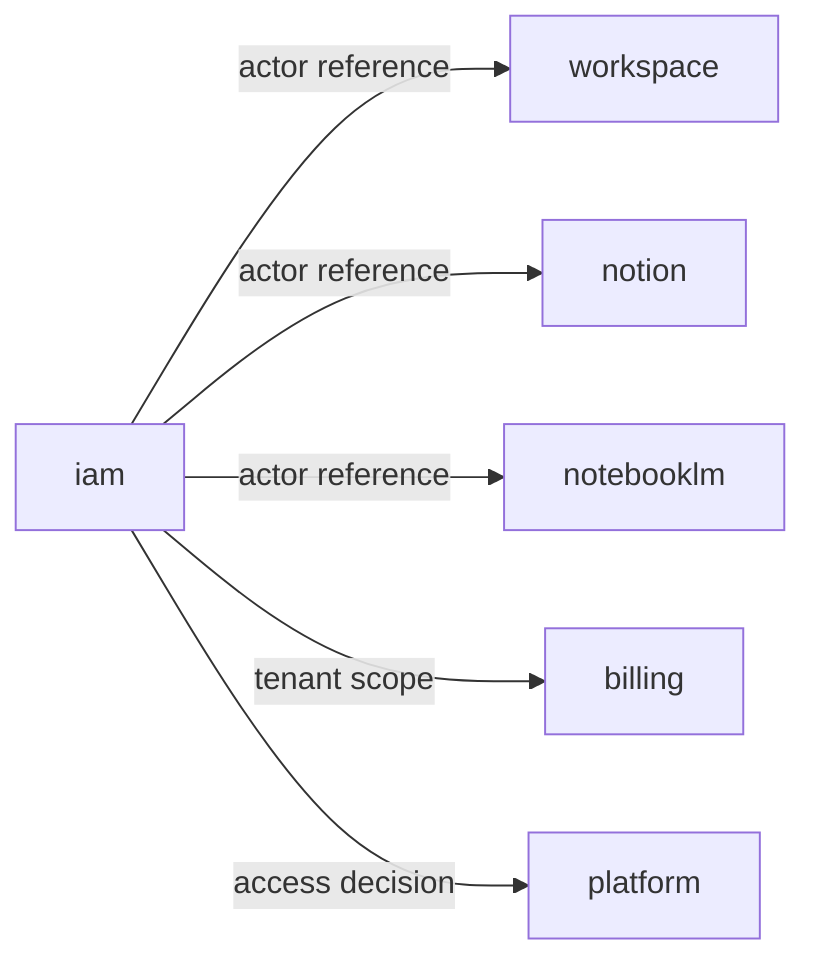

# IAM Context — Agent Guide

本文件在本次任務限制下，僅依 Context7 驗證的 DDD、Context Map、Hexagonal Architecture 參考整理，不主張反映現況實作。

## Mission

保護 iam 主域作為身份、存取、帳號、組織的正典所有者。account 與 organization 已從 platform 遷入此主域；任何新功能都應先問：這是身份治理還是平台操作服務？

## Canonical Ownership

- identity（已驗證主體、身份信號）
- access-control（授權判定）
- tenant（多租戶隔離）
- security-policy（安全規則定義）
- account（帳號聚合根，原 platform/account，已遷入）
- organization（組織邊界，原 platform/organization，已遷入）
- session（session 與 token lifecycle，gap subdomain）
- consent（同意與授權治理，gap subdomain）
- secret-governance（secret access policy，gap subdomain）

> **遷移備注：** `platform/account` 與 `platform/organization` 已完全遷入 `iam/subdomains/account/` 與 `iam/subdomains/organization/`。
> 不應在 platform 新增 account / org 相關程式碼。

## Route Here When

- 問題核心是身份驗證、存取判定、多租戶隔離、帳號生命週期或組織管理。
- 問題涉及 Actor、Identity、Tenant、AccessDecision、Account、Organization。

## Route Elsewhere When

- 平台設定、通知、搜尋 → platform。
- 工作區參與關係（Membership）→ workspace。
- 商業授權（Entitlement）→ billing。
- AI 模型使用政策 → ai。

## Guardrails

- 下游主域只消費 `actor reference`、`tenant scope`、`access decision`，不持有 iam aggregate 完整模型。
- account / org 相關寫入操作一律進 iam；platform 不得新增 account / org 邏輯。
- 跨主域互動只經由 published language tokens。

## Hard Prohibitions

- ❌ 在 platform 新增 account / org 相關業務邏輯（已遷入 iam）。
- ❌ 讓 iam 持有 billing Entitlement、AI Policy 或 Content 模型。
- ❌ 在 domain/ 匯入 Firebase SDK、React 或任何框架。

## Copilot Generation Rules

- 生成程式碼時，先確認需求屬於 identity / access / account / org / tenant / session 哪個邊界。
- 帳號 / 組織相關需求一律落在 `src/modules/iam/subdomains/account/` 或 `src/modules/iam/subdomains/organization/`。
- 奧卡姆剃刀：若能用 access decision 解決，不要暴露完整 identity aggregate。

## Dependency Direction Flow

## Document Network

- [README.md](./README.md)
- [bounded-contexts.md](./bounded-contexts.md)
- [context-map.md](./context-map.md)
- [subdomains.md](./subdomains.md)
- [ubiquitous-language.md](./ubiquitous-language.md)
- 
        param($m)
        $dir = $m.Groups[1].Value
        $file = $m.Groups[2].Value
        "[$file](../../$dir/$file)"
    
- 
        param($m)
        $dir = $m.Groups[1].Value
        $file = $m.Groups[2].Value
        "[$file](../../$dir/$file)"
    
- 
        param($m)
        $dir = $m.Groups[1].Value
        $file = $m.Groups[2].Value
        "[$file](../../$dir/$file)"
    
