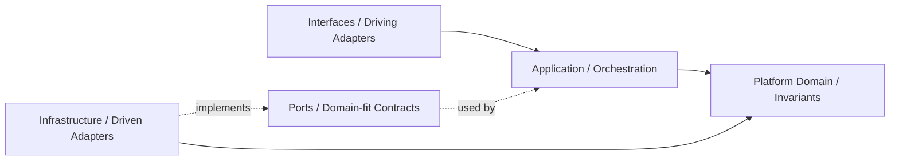
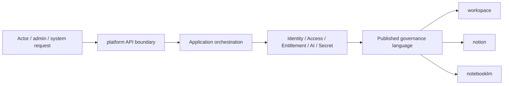

# Platform Agent

本文件在本次任務限制下，僅依 Context7 驗證的 DDD、Context Map、Hexagonal Architecture 參考整理，不主張反映現況實作。

## Mission

保護 platform 主域作為營運支撐邊界。platform 提供 notification、background-job、search、audit-log、observability 等橫切能力，不再持有 account、organization 的正典語言（已遷入 iam）。任何變更應維持對 operational services 的所有權，不吸收 iam、billing、ai、workspace、notion、notebooklm 的正典語言。

## Canonical Ownership

> **已遷出（不在 platform）：**  
> - `account` / `account-profile` → `iam/subdomains/account/`  
> - `organization` / `team` → `iam/subdomains/organization/`

- platform-config
- feature-flag
- onboarding
- compliance
- consent
- integration
- secret-management
- workflow
- notification
- background-job
- content
- search
- audit-log
- observability
- support

## Route Here When

- 問題核心是 notification、search、audit-log、observability 或支援能力。
- 問題核心是平台級 workflow、background job、integration 或 secret-management。
- 問題需要提供其他主域共同消費的 operational services。

## Route Elsewhere When

- 工作區生命週期、成員關係、共享與存在感屬於 workspace。
- 知識內容建立、分類、關聯與發布屬於 notion。
- 對話、來源、retrieval、grounding、synthesis 屬於 notebooklm。

## Guardrails

- Actor、Identity、Tenant、AccessDecision 屬於 iam，platform 不重定義它們。
- Subscription、Entitlement、BillingEvent 屬於 billing，platform 只消費 capability signal。
- shared AI capability 屬於 ai context，不等於 notebooklm 的推理輸出所有權。
- secret-management 應與 integration 分離，避免憑證語義擴散。
- consent 與 compliance 有關，但不是同一個 bounded context。
- platform 提供營運服務，不接管其他主域的正典內容生命週期。
- account 與 organization 正典語言屬於 iam，請勿在 platform 重建。

## Dependency Direction

- platform 內部依賴方向固定為 interfaces -> application -> domain <- infrastructure。
- access-control、entitlement、secret-management 等外部依賴只能透過 ports 進入核心。
- infrastructure 只實作治理能力與外部整合，不反向定義 Actor、Tenant、Entitlement 語言。

## Hard Prohibitions

- 不得讓 platform 直接接管 workspace、notion、notebooklm 的正典業務流程。
- 不得讓 domain 或 application 直接依賴第三方身份、通知、計費或 secret SDK。
- 不得在其他主域重建 Actor、Tenant、Entitlement、Secret 的正典模型。

## Copilot Generation Rules

- 生成程式碼時，先保留 platform 作為 operational supplier，而不是治理、內容或推理 owner。
- notion 與 notebooklm 若需要 AI 能力，先走 ai context 的 published language / API boundary。
- 奧卡姆剃刀：若既有治理子域與單一 use case 能承接需求，就不要新增第二層 policy service、flag service 或 entitlement facade。
- 只有在外部依賴、敏感治理或跨主域轉譯明確存在時，才建立 port、ACL 或 local DTO。
- 對 workspace、notion、notebooklm 的輸出應停在 published language / API boundary。

## Dependency Direction Flow

## Correct Interaction Flow

## Document Network

- [README.md](./README.md)
- [bounded-contexts.md](./bounded-contexts.md)
- [context-map.md](./context-map.md)
- [subdomains.md](./subdomains.md)
- [ubiquitous-language.md](./ubiquitous-language.md)
- [architecture-overview.md](../system/architecture-overview.md)
- [integration-guidelines.md](../system/integration-guidelines.md)
