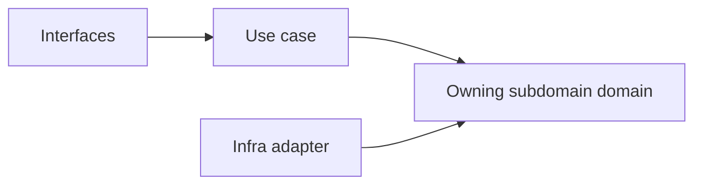
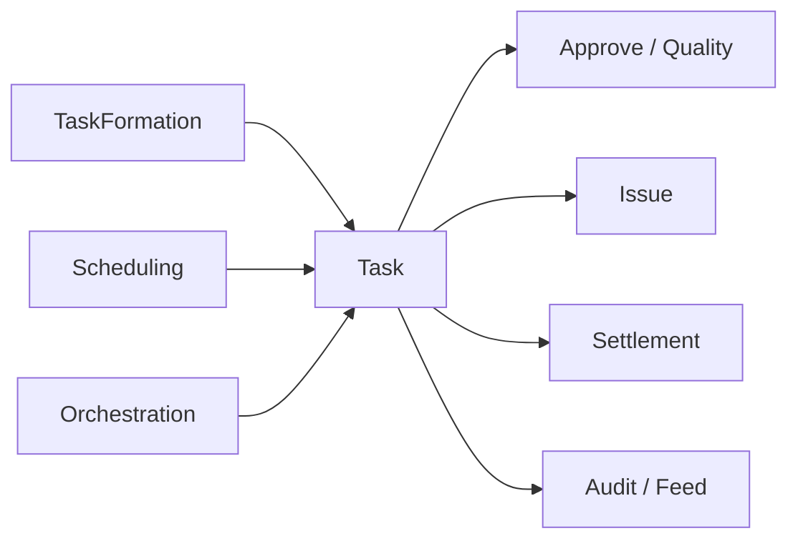

# Workspace

本文件在本次任務限制下，僅依 Context7 驗證的 DDD、Context Map、Hexagonal Architecture 參考整理，不主張反映現況實作。

## Baseline Subdomains

| Subdomain | Responsibility |
|---|---|
| audit | 工作區操作日誌與證據追蹤 |
| feed | 工作區活動摘要與事件流呈現 |
| scheduling | 工作區排程、時序與提醒協調 |
| approve | 任務驗收與問題單覆核審批流程 |
| issue | 問題單生命週期與追蹤管理 |
| orchestration | 知識頁面→任務物化批次作業編排 |
| quality | 任務 QA 審查與質檢流程 |
| settlement | 請款發票生命週期與財務對帳 |
| task | 任務建立、指派與狀態轉換 |
| task-formation | AI 輔助任務候選抽取與批次匯入 |

## Recommended Gap Subdomains

| Subdomain | Why Needed |
|---|---|
| lifecycle | 把工作區容器生命週期獨立成正典邊界 |
| membership | 把工作區參與關係從平台身份治理中切開 |
| sharing | 把對外共享與可見性規則收斂到單一上下文 |
| presence | 把即時協作存在感與共同編輯訊號形成本地語言 |

## Recommended Order

1. lifecycle
2. membership
3. sharing
4. presence

## Anti-Patterns

- 不把 lifecycle 混進 orchestration，使容器生命週期被流程編排吞沒。
- 不把 membership 混成 organization 或 identity。
- 不把 sharing 混成一般 permission 欄位集合。
- 不把 presence 藏進 UI 狀態而失去獨立語言。
- 不用 `workspace-workflow` 混指已分解的 task、issue、settlement、approve、quality、orchestration 等獨立子域。

## Copilot Generation Rules

- 生成程式碼時，先確認需求屬於哪個 workspace 責任（task/issue/settlement/approve/quality/orchestration/audit/feed/scheduling），再決定 use case 與 boundary。
- 工作區流程責任已分解為多個專門子域，避免與 `platform.workflow` 混名。
- 奧卡姆剃刀：能在既有子域用一個清楚 use case 解決，就不要新建語意重疊的 scope 子域。
- 子域命名必須反映工作區語義，不應退化成頁面或元件名稱。

## Dependency Direction Flow

## Correct Interaction Flow

## Document Network

- [README.md](./README.md)
- [bounded-contexts.md](./bounded-contexts.md)
- [context-map.md](./context-map.md)
- [ubiquitous-language.md](./ubiquitous-language.md)
- [../../subdomains.md](../../subdomains.md)
- [../../bounded-contexts.md](../../bounded-contexts.md)