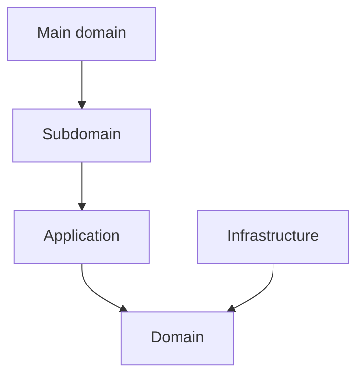
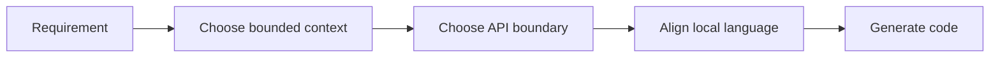

# Bounded Contexts

## Strategic Bounded Context Model

系統目前以八個主域 / bounded context 構成。每個主域下可再分成 baseline subdomains 與 recommended gap subdomains。

## Main Domain Map

| Main Domain | Strategic Role | Baseline Focus | Recommended Gap Focus |
|---|---|---|---|
| iam | 身份與存取治理 | identity、access-control、tenant、security-policy、**account、organization** | session、consent、secret-governance |
| billing | 商業與權益治理 | billing、subscription、entitlement、referral | pricing、invoice、quota-policy |
| ai | 共享 AI capability | generation、orchestration、distillation、retrieval、memory、context、safety、tool-calling、reasoning、conversation、evaluation、tracing | provider-routing、model-policy |
| analytics | 分析與 read model 下游 | reporting、metrics、dashboards、telemetry-projection | experimentation、decision-support |
| platform | 平台營運支撐 | notification、search、audit-log、observability、platform-config、feature-flag、onboarding | consent、secret-management、operational-catalog |
| workspace | 協作容器與 scope | audit、feed、scheduling、approve、issue、orchestration、quality、settlement、task、task-formation | lifecycle、membership、sharing、presence |
| notion | 正典知識內容 | knowledge、authoring、collaboration、knowledge-database、templates、knowledge-versioning | taxonomy、relations、publishing |
| notebooklm | 對話與推理 | conversation、note、notebook、source、synthesis、conversation-versioning | ingestion、retrieval、grounding、evaluation |

## Subdomain Inventory By Main Domain

### iam

#### Baseline Subdomains

| Subdomain | 功能註解 |
|---|---|
| identity | 已驗證主體與身份信號治理 |
| access-control | 主體現在能做什麼的授權判定 |
| tenant | 多租戶隔離與 tenant-scoped 規則治理 |
| security-policy | 安全規則定義、版本化與發佈 |
| account | 帳號聚合根與帳號生命週期（從 platform 遷入） |
| organization | 組織、成員與角色邊界（從 platform 遷入） |

#### Recommended Gap Subdomains

| Subdomain | 功能註解 |
|---|---|
| session | 將 session 與 token lifecycle 收斂為獨立能力 |
| consent | 將同意與授權治理從泛用平台設定中切開 |
| secret-governance | 將 secret access policy 收斂為明確治理邊界 |

### billing

#### Baseline Subdomains

| Subdomain | 功能註解 |
|---|---|
| billing | 計費狀態、費率與財務證據 |
| subscription | 方案、配額與續期治理 |
| entitlement | 有效權益與功能可用性統一解算 |
| referral | 推薦關係與獎勵追蹤 |

#### Recommended Gap Subdomains

| Subdomain | 功能註解 |
|---|---|
| pricing | 價格模型與方案矩陣治理 |
| invoice | 帳單、請款與對帳流程 |
| quota-policy | 將可量化商業限制收斂成單一政策語言 |

### ai

#### Baseline Subdomains

| Subdomain | 功能註解 |
|---|---|
| generation | AI 驅動的文本生成與回覆輸出（Genkit 接縫） |
| orchestration | 執行圖與多步驟 AI workflow 協調 |
| distillation | 將長輸出或多來源濃縮為精煉知識片段 |
| retrieval | 向量搜尋、相似度查詢與上下文抓取 |
| memory | 對話歷史與跨輪次狀態保存 |
| context | prompt 上下文組裝與 token 預算管理 |
| safety | 安全護欄、有害內容過濾與合規保護 |
| tool-calling | 外部工具調用協調與結果回注 |
| reasoning | 推理步驟管理（chain-of-thought、反思） |
| conversation | AI 互動輪次追蹤與歷史管理 |
| evaluation | 輸出品質評估與回歸基準 |
| tracing | AI 執行觀測、span 紀錄與成本追蹤 |

#### Recommended Gap Subdomains

| Subdomain | 功能註解 |
|---|---|
| provider-routing | 模型供應商選擇與路由治理 |
| model-policy | 模型能力、版本與使用政策 |

### analytics

#### Baseline Subdomains

| Subdomain | 功能註解 |
|---|---|
| reporting | 報表輸出與查詢整理 |
| metrics | 指標定義與聚合 |
| dashboards | 儀表板呈現語義 |
| telemetry-projection | 事件投影與 read model 匯總 |

#### Recommended Gap Subdomains

| Subdomain | 功能註解 |
|---|---|
| experimentation | 實驗分析與對照觀測 |
| decision-support | 決策輔助與洞察輸出 |

### workspace

#### Baseline Subdomains

| Subdomain | 功能註解 |
|---|---|
| audit | 工作區操作日誌與證據追蹤 |
| feed | 工作區活動摘要與事件流呈現 |
| scheduling | 工作區排程、時序與提醒協調 |
| approve | 任務驗收與問題單覆核審批流程 |
| issue | 問題單生命週期與追蹤管理 |
| orchestration | 知識頁面→任務物化批次作業編排 |
| quality | 任務 QA 審查與質檢流程 |
| settlement | 請款發票生命週期與財務對帳 |
| task | 任務建立、指派與狀態轉換 |
| task-formation | AI 輔助任務候選抽取與批次匯入 |

#### Recommended Gap Subdomains

| Subdomain | 功能註解 |
|---|---|
| lifecycle | 將工作區容器生命週期獨立為正典邊界（建立、封存、復原） |
| membership | 將工作區參與關係從平台身份治理切開（角色、加入、移除） |
| sharing | 將共享範圍與可見性規則收斂到單一上下文（對內/對外分享） |
| presence | 將即時協作存在感、共同編輯訊號收斂為本地語言 |

### platform

#### Baseline Subdomains

| Subdomain | 功能註解 |
|---|---|
| platform-config | 平台設定輪廓與配置管理 |
| feature-flag | 功能開關策略與發佈節點 |
| onboarding | 新主體初始設定與引導流程 |
| compliance | 資料保留、日誌與法規執行 |
| integration | 外部系統整合邊界與契約 |
| workflow | 平台級流程編排與狀態驅動執行 |
| notification | 通知路由、偏好與投遞 |
| background-job | 背景任務提交、排程與監控 |
| content | 平台級內容資產管理與發布 |
| search | 跨域搜尋路由與查詢協調 |
| audit-log | 永久日誌軌跡與不可否認證據 |
| observability | 健康量測、追蹤與告警 |
| support | 客服工單、支援知識與處理流程 |

> **遷出子域：** `account` / `account-profile` → `iam/subdomains/account/`；`organization` / `team` → `iam/subdomains/organization/`

#### Recommended Gap Subdomains

| Subdomain | 功能註解 |
|---|---|
| consent | 將同意與資料使用授權從 compliance 中切開 |
| secret-management | 將憑證、token、rotation 從 integration 中切開 |
| operational-catalog | 將平台營運資產與配置字典收斂成單一邊界 |

### notion

#### Baseline Subdomains

| Subdomain | 功能註解 |
|---|---|
| knowledge | 頁面建立、組織、版本化與交付 |
| authoring | 知識庫文章建立、驗證與分類 |
| collaboration | 協作留言、細粒度權限與版本快照 |
| knowledge-database | 結構化資料多視圖管理 |
| knowledge-engagement | 知識使用行為量測 |
| attachments | 附件與媒體關聯儲存 |
| automation | 知識事件觸發自動化動作 |
| external-knowledge-sync | 知識與外部系統雙向整合 |
| notes | 個人輕量筆記與正式知識協作 |
| templates | 頁面範本管理與套用 |
| knowledge-versioning | 全域版本快照策略管理 |

#### Recommended Gap Subdomains

| Subdomain | 功能註解 |
|---|---|
| taxonomy | 建立分類法與語義組織的正典邊界 |
| relations | 建立內容之間關聯與 backlink 的正典邊界 |
| publishing | 建立正式發布與對外交付的正典邊界 |

### notebooklm

#### Baseline Subdomains

| Subdomain | 功能註解 |
|---|---|
| conversation | 對話 Thread 與 Message 生命週期 |
| note | 輕量筆記與知識連結 |
| notebook | Notebook 組合與管理 |
| source | 來源文件追蹤與引用 |
| synthesis | RAG 合成、摘要與洞察生成 |
| conversation-versioning | 對話版本與快照策略 |

#### Recommended Gap Subdomains

| Subdomain | 功能註解 |
|---|---|
| ingestion | 建立來源匯入、正規化與前處理的正典邊界 |
| retrieval | 建立查詢召回與排序策略的正典邊界 |
| grounding | 建立引用對齊與可追溯證據的正典邊界 |
| evaluation | 建立品質評估與回歸比較的正典邊界 |

## Ownership Rules

- iam 擁有身份、租戶、access decision、account 與 organization，不擁有商業、內容或推理正典。
- billing 擁有 subscription 與 entitlement，不擁有身份治理或內容正典。
- ai 擁有 shared AI capability，不擁有內容或 notebook 推理正典。
- analytics 擁有下游報表與 projection，不擁有上游寫入模型。
- platform 擁有 operational service（notification、search、audit-log 等），不再擁有 account 與 organization 正典。
- workspace 擁有工作區範疇，不擁有平台治理或正典內容。
- notion 擁有正典知識內容，不擁有治理或推理流程。
- notebooklm 擁有推理流程與衍生輸出，不擁有正典知識內容。

## Dependency Direction Guardrail

- bounded context 所有權定義的是語言與規則邊界，不等於可直接穿透的實作邊界。
- 每個主域內部仍必須遵守 interfaces -> application -> domain <- infrastructure。
- 跨主域整合一律先經 API boundary、published language、events 或 local DTO。

## Conflict Resolution

- 若某子域同時被多個主域宣稱，依最能維持語言自洽與 context map 方向的主域保留所有權。
- 若某能力定義 actor、identity、tenant 或 access decision，優先歸 iam。
- 若某能力定義 subscription、entitlement、pricing 或 referral，優先歸 billing。
- 若某能力定義 shared model capability、provider routing、safety 或 prompt orchestration，優先歸 ai。
- 若某能力只消費事件並形成報表或 read model，優先歸 analytics。
- 若某能力同時像內容又像推理輸出，先問它是否是正典內容狀態；若是，歸 notion，否則歸 notebooklm。
- `workflow` 作為 generic 名稱只保留在 platform；workspace 的流程能力已分解為 task、issue、settlement、approve、quality、orchestration 等獨立子域。

## Forbidden Ownership Moves

- 不得讓兩個主域同時宣稱同一正典模型所有權。
- 不得用部署、資料表或 UI 分區來覆蓋 bounded context 所有權。
- 不得把 gap subdomain 缺口視為可以任意分散到其他主域的理由。
- 不得讓同一個 generic 子域名稱同時作為多個主域的 canonical ownership。

## Copilot Generation Rules

- 生成程式碼時，先決定 owning bounded context，再決定檔案位置、命名與 boundary。
- 奧卡姆剃刀：若既有 bounded context 可吸收需求，就不要為了命名好看而新增新的上下文。
- 所有權模糊時，先修正文檔邊界，再寫程式碼。

## Dependency Direction Flow

## Correct Interaction Flow

## Document Network

- [architecture-overview.md](../system/architecture-overview.md)
- [subdomains.md](./subdomains.md)
- [context-map.md](../system/context-map.md)
- [bounded-context-subdomain-template.md](./bounded-context-subdomain-template.md)
- [project-delivery-milestones.md](../system/project-delivery-milestones.md)
- [decisions/0001-hexagonal-architecture.md](../../decisions/0001-hexagonal-architecture.md)
- [decisions/0002-bounded-contexts.md](../../decisions/0002-bounded-contexts.md)