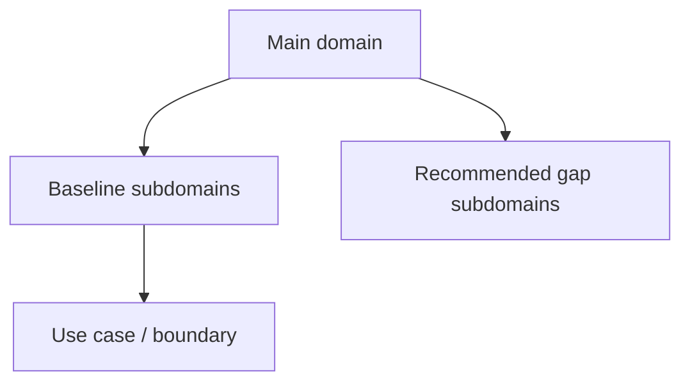
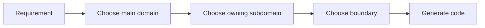

# Subdomains

本文件在本次任務限制下，僅依 Context7 驗證的 bounded context 與 strategic design 原則重建，不主張反映現況實作。

## Main Domain Inventory

| Main Domain | Baseline Subdomains | Recommended Gap Subdomains |
|---|---|---|
| iam | identity, access-control, tenant, security-policy, **account, organization** | session, consent, secret-governance |
| billing | billing, subscription, entitlement, referral | pricing, invoice, quota-policy |
| ai | generation, orchestration, distillation, retrieval, memory, context, safety, tool-calling, reasoning, conversation, evaluation, tracing | provider-routing, model-policy |
| analytics | reporting, metrics, dashboards, telemetry-projection | experimentation, decision-support |
| platform | platform-config, feature-flag, onboarding, compliance, integration, workflow, notification, background-job, content, search, audit-log, observability, support | consent, secret-management |
| workspace | audit, feed, scheduling, approve, issue, orchestration, quality, settlement, task, task-formation | lifecycle, membership, sharing, presence |
| notion | knowledge, authoring, collaboration, knowledge-database, knowledge-engagement, attachments, automation, external-knowledge-sync, notes, templates, knowledge-versioning | taxonomy, relations, publishing |
| notebooklm | conversation, note, notebook, source, synthesis, conversation-versioning | ingestion, retrieval, grounding, evaluation |

## Detailed Subdomain Catalog

### iam

#### Baseline Subdomains

| Subdomain | 功能註解 |
|---|---|
| identity | 已驗證主體與身份信號治理 |
| access-control | 主體現在能做什麼的授權判定 |
| tenant | 多租戶隔離與 tenant-scoped 規則治理 |
| security-policy | 安全規則定義、版本化與發佈 |
| account | 帳號聚合根與帳號生命週期（從 platform 遷入） |
| organization | 組織、成員與角色邊界（從 platform 遷入） |

#### Recommended Gap Subdomains

| Subdomain | 功能註解 |
|---|---|
| session | session、token 與 identity lifecycle 收斂 |
| consent | 同意與資料使用授權治理收斂 |
| secret-governance | secret 與 credential access policy 收斂 |

### billing

#### Baseline Subdomains

| Subdomain | 功能註解 |
|---|---|
| billing | 計費狀態、費率與財務證據 |
| subscription | 方案、配額與續期治理 |
| entitlement | 有效權益與功能可用性統一解算 |
| referral | 推薦關係與獎勵追蹤 |

#### Recommended Gap Subdomains

| Subdomain | 功能註解 |
|---|---|
| pricing | 價格模型與方案矩陣治理 |
| invoice | 帳單、請款與對帳流程 |
| quota-policy | 可量化配額與商業限制規則 |

### ai

#### Baseline Subdomains

| Subdomain | 功能註解 |
|---|---|
| generation | AI 驅動的文本生成與回覆輸出（Genkit 接縫） |
| orchestration | 執行圖與多步驟 AI workflow 協調 |
| distillation | 將長輸出或多來源濃縮為精煉知識片段 |
| retrieval | 向量搜尋、相似度查詢與上下文抓取 |
| memory | 對話歷史與跨輪次狀態保存 |
| context | prompt 上下文組裝與 token 預算管理 |
| safety | 安全護欄、有害內容過濾與合規保護 |
| tool-calling | 外部工具調用協調與結果回注 |
| reasoning | 推理步驟管理（chain-of-thought、反思） |
| conversation | AI 互動輪次追蹤與歷史管理 |
| evaluation | 輸出品質評估與回歸基準 |
| tracing | AI 執行觀測、span 紀錄與成本追蹤 |

#### Recommended Gap Subdomains

| Subdomain | 功能註解 |
|---|---|
| provider-routing | 模型供應商選擇與路由治理 |
| model-policy | 模型能力、版本與使用政策 |

### analytics

#### Baseline Subdomains

| Subdomain | 功能註解 |
|---|---|
| reporting | 報表輸出與查詢整理 |
| metrics | 指標定義與聚合 |
| dashboards | 儀表板呈現語義 |
| telemetry-projection | 事件投影與 read model 匯總 |

#### Recommended Gap Subdomains

| Subdomain | 功能註解 |
|---|---|
| experimentation | 實驗分析與對照觀測 |
| decision-support | 決策輔助與洞察輸出 |

### workspace

#### Baseline Subdomains

| Subdomain | 功能註解 |
|---|---|
| audit | 工作區操作日誌與證據追蹤 |
| feed | 工作區活動摘要與事件流呈現 |
| scheduling | 工作區排程、時序與提醒協調 |
| approve | 任務驗收與問題單覆核審批流程 |
| issue | 問題單生命週期與追蹤管理 |
| orchestration | 知識頁面→任務物化批次作業編排 |
| quality | 任務 QA 審查與質檢流程 |
| settlement | 請款發票生命週期與財務對帳 |
| task | 任務建立、指派與狀態轉換 |
| task-formation | AI 輔助任務候選抽取與批次匯入 |

#### Recommended Gap Subdomains

| Subdomain | 功能註解 |
|---|---|
| lifecycle | 將工作區容器生命週期獨立為正典邊界（建立、封存、復原） |
| membership | 將工作區參與關係從平台身份治理切開（角色、加入、移除） |
| sharing | 將共享範圍與可見性規則收斂到單一上下文（對內/對外分享） |
| presence | 將即時協作存在感、共同編輯訊號收斂為本地語言 |

### platform

#### Baseline Subdomains

| Subdomain | 功能註解 |
|---|---|
| platform-config | 平台設定輪廓與配置管理 |
| feature-flag | 功能開關策略與發佈節點 |
| onboarding | 新主體初始設定與引導流程 |
| compliance | 資料保留、日誌與法規執行 |
| integration | 外部系統整合邊界與契約 |
| workflow | 平台級流程編排與狀態驅動執行 |
| notification | 通知路由、偏好與投遞 |
| background-job | 背景任務提交、排程與監控 |
| content | 平台級內容資產管理與發布 |
| search | 跨域搜尋路由與查詢協調 |
| audit-log | 永久日誌軌跡與不可否認證據 |
| observability | 健康量測、追蹤與告警 |
| support | 客服工單、支援知識與處理流程 |

> **遷出子域：** `account` / `account-profile` → `iam/subdomains/account/`；`organization` / `team` → `iam/subdomains/organization/`

#### Recommended Gap Subdomains

| Subdomain | 功能註解 |
|---|---|
| consent | 將同意與資料使用授權從 compliance 中切開 |
| secret-management | 將憑證、token、rotation 從 integration 中切開 |
| operational-catalog | 將平台營運資產與配置字典收斂成單一邊界 |

### notion

#### Baseline Subdomains

| Subdomain | 功能註解 |
|---|---|
| knowledge | 頁面建立、組織、版本化與交付 |
| authoring | 知識庫文章建立、驗證與分類 |
| collaboration | 協作留言、細粒度權限與版本快照 |
| knowledge-database | 結構化資料多視圖管理 |
| knowledge-engagement | 知識使用行為量測 |
| attachments | 附件與媒體關聯儲存 |
| automation | 知識事件觸發自動化動作 |
| external-knowledge-sync | 知識與外部系統雙向整合 |
| notes | 個人輕量筆記與正式知識協作 |
| templates | 頁面範本管理與套用 |
| knowledge-versioning | 全域版本快照策略管理 |

#### Recommended Gap Subdomains

| Subdomain | 功能註解 |
|---|---|
| taxonomy | 建立分類法與語義組織的正典邊界 |
| relations | 建立內容之間關聯與 backlink 的正典邊界 |
| publishing | 建立正式發布與對外交付的正典邊界 |

### notebooklm

#### Baseline Subdomains

| Subdomain | 功能註解 |
|---|---|
| conversation | 對話 Thread 與 Message 生命週期 |
| note | 輕量筆記與知識連結 |
| notebook | Notebook 組合與管理 |
| source | 來源文件追蹤與引用 |
| synthesis | RAG 合成、摘要與洞察生成 |
| conversation-versioning | 對話版本與快照策略 |

#### Recommended Gap Subdomains

| Subdomain | 功能註解 |
|---|---|
| ingestion | 建立來源匯入、正規化與前處理的正典邊界 |
| retrieval | 建立查詢召回與排序策略的正典邊界 |
| grounding | 建立引用對齊與可追溯證據的正典邊界 |
| evaluation | 建立品質評估與回歸比較的正典邊界 |

## Strategic Notes

- baseline subdomains 代表本架構基線中已確立的核心切分。
- recommended gap subdomains 代表依 Context7 推導出的合理補洞方向。
- recommended gap subdomains 不等於已驗證現況實作。

## Ownership Summary

- iam 關心身份、租戶、存取治理、account 與 organization 聚合根。
- billing 關心商業生命週期與有效權益。
- ai 關心共享 AI capability 與模型政策。
- analytics 關心下游分析、指標與 read model 投影。
- platform 關心 operational service（通知、搜尋、日誌、可觀測性等），不再擁有 account 與 organization。
- workspace 關心協作範疇。
- notion 關心正典知識內容。
- notebooklm 關心推理與衍生輸出。

## Cross-Domain Duplicate Resolution

| Original Term | Resolution |
|---|---|
| ai | `ai` context 擁有 generic AI capability；`notion` 與 `notebooklm` 僅為 consumer |
| analytics | `analytics` context 擁有 generic analytics；`notion` 保留 `knowledge-engagement` |
| entitlement | `billing` 擁有 entitlement；其他主域只消費 capability signal |
| identity | `iam` 擁有 identity 與 access-control；其他主域不再各自宣稱 |
| integration | `platform` 保留 generic `integration`；`notion` 保留 `external-knowledge-sync` |
| versioning | `notion` 改為 `knowledge-versioning`；`notebooklm` 改為 `conversation-versioning` |
| workflow | `platform` 保留 generic `workflow`；workspace 的流程能力已分解為 task、issue、settlement、approve、quality、orchestration 等獨立子域 |

## Subdomain Anti-Patterns

- 不把 baseline subdomains 與 recommended gap subdomains 混成同一種事實狀態。
- 不把主域缺口直接分攤到別的主域，造成所有權漂移。
- 不把子域名稱當成 UI 功能清單，而忽略其邊界責任。
- 不讓同一個 generic 子域名稱同時被多個主域擁有，造成 Copilot 與團隊語言歧義。

## Copilot Generation Rules

- 生成程式碼時，先確認需求屬於哪個主域與子域，再決定實作位置。
- 奧卡姆剃刀：能放進既有子域就不要創造新子域；能放進既有 use case 就不要新增第二條平行流程。
- gap subdomain 只表示架構缺口，不表示一定要立刻實作。
- 遇到 generic 名稱時，先套用本文件的 duplicate resolution，再決定是否新增或改名。

## Dependency Direction Flow

## Correct Interaction Flow

## Document Network

- [architecture-overview.md](../system/architecture-overview.md)
- [bounded-contexts.md](./bounded-contexts.md)
- [bounded-context-subdomain-template.md](./bounded-context-subdomain-template.md)
- [project-delivery-milestones.md](../system/project-delivery-milestones.md)
- [contexts/workspace/subdomains.md](../contexts/workspace/subdomains.md)
- [contexts/platform/subdomains.md](../contexts/platform/subdomains.md)
- [contexts/notion/subdomains.md](../contexts/notion/subdomains.md)
- [contexts/notebooklm/subdomains.md](../contexts/notebooklm/subdomains.md)