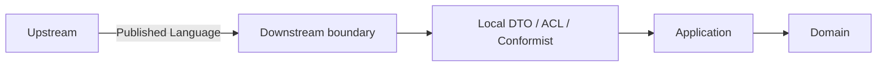
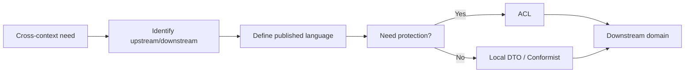

# Integration Guidelines

本文件在本次任務限制下，僅依 Context7 驗證的 published language、ACL、Conformist 與 hexagonal boundary 原則重建，不主張反映現況實作。

## Boundary Contract

跨主域整合只能使用：

- published language
- public API boundary
- domain / integration events
- local DTO
- downstream ACL 或 downstream Conformist

## Pattern Selection Rules

| Situation | Pattern |
|---|---|
| 下游與上游語義高度一致，且不會扭曲本地語言 | Conformist |
| 上游語義會污染下游本地語言 | Anti-Corruption Layer |
| 只是跨主域資料交換 | Published Language + Local DTO |

## Hard Rules

- ACL 與 Conformist 只能由 downstream 選擇。
- ACL 與 Conformist 互斥。
- 不可直接傳遞上游 entity / aggregate 作為下游正典模型。
- 不可把 shared technical package 誤當成 strategic shared kernel。
- 若需要共同語義，先定 published language，再定 DTO，再評估是否需要 ACL。

## Domain-Specific Guidance

- workspace 消費 iam、billing 或 platform 時，優先保護自己的 membership、sharing、presence 語言。
- notion 消費 iam、billing、ai 或 workspace 時，優先保護自己的 knowledge artifact 與 taxonomy 語言。
- notebooklm 消費 notion、iam、billing 或 ai 時，優先保護自己的 retrieval、grounding、synthesis 語言。
- analytics 消費其他主域時，應以 event projection 與 local read model 為主，不回寫上游 canonical model。

## App Router Boundary Guidance

- App Router path shape 是 composition contract，不是跨主域 published language 的替代品。
- 即使 path 以 `/{accountId}/{workspaceId}` 呈現，platform 與 workspace 之間的語意交換仍必須走 API boundary、published language 或 events。
- shell 內所有 workspace detail href 應優先輸出 canonical `/{accountId}/{workspaceId}`，而不是 `/{accountId}/workspace/{workspaceId}`。
- legacy redirect path 可以短期保留作為 compatibility surface，但文件、設計稿與新程式碼不應再以 legacy path 當作正典契約。
- route redirect、query-state 正規化與 URL composition 屬於 interfaces / app composition concern，不應回滲為 domain rule 或跨主域契約。

## Identifier Boundary Rules

- `accountId` 只用於 shell / composition 層的 account scope，或 account-scoped downstream input；不要把它直接當成 `workspaceId`、`organizationId` 或 `userId`。
- `workspaceId` 只表示協作容器 scope；跨主域 published language 若需要 workspace context，應明確傳遞 `workspaceId`，不要讓 notion / notebooklm 猜測 route segment。
- `organizationId` 只用於 organization-scoped domain 或 integration contract；若某 flow 由 organization account 的 `accountId` 進入，需在 application / mapper 層顯式轉成 `organizationId`。
- `userId` 用於具體使用者欄位，例如 `createdByUserId`、`verifiedByUserId`、`submittedByUserId`、`assignedUserId`；`actorId` 用於行為主體 metadata，不保證一定是 user。
- `ownerId` 表示資源所有者；`tenantId` 表示租戶隔離鍵；兩者都不是 canonical route param。
- `fileId` 是檔案 metadata 主鍵；不能取代 owner / workspace / tenant scope，也不能單獨表示授權邊界。

## Integration Checklist

1. 先確認 upstream / downstream 方向。
2. 先列出 published language。
3. 判斷是否語義一致。
4. 一致則考慮 conformist，不一致則建立 ACL。
5. 避免把 DTO、entity、policy、UI 狀態混成同一層。

## Integration Anti-Patterns

- 直接傳遞上游 aggregate、entity、repository 給下游使用。
- 讓 downstream 省略 published language 與 local DTO，直接貼靠上游內部模型。
- 把 ACL 當成預設樣板卻不判斷是否真的有語義污染。

## Copilot Generation Rules

- 生成程式碼時，先決定 upstream、downstream、published language，再決定 DTO、ACL 或 Conformist。
- 奧卡姆剃刀：若 published language 加 local DTO 已足夠，就不要額外建立雙重 mapper、雙重 ACL 或鏡像 aggregate。
- 只有在上游語義真的會污染本地語言時，才建立 ACL。

## Dependency Direction Flow

## Correct Interaction Flow

## Document Network

- [context-map.md](./context-map.md)
- [strategic-patterns.md](./strategic-patterns.md)
- [architecture-overview.md](./architecture-overview.md)
- [bounded-context-subdomain-template.md](../domain/bounded-context-subdomain-template.md)
- [project-delivery-milestones.md](./project-delivery-milestones.md)
- [decisions/0001-hexagonal-architecture.md](../../decisions/0001-hexagonal-architecture.md)
- [decisions/0003-context-map.md](../../decisions/0003-context-map.md)
- [decisions/0005-anti-corruption-layer.md](../../decisions/0005-anti-corruption-layer.md)

## Conflict Resolution

- 若某整合指南與 [context-map.md](./context-map.md) 的方向衝突，以 context map 為準。
- 若某整合指南與 [decisions/0005-anti-corruption-layer.md](../../decisions/0005-anti-corruption-layer.md) 衝突，以 ADR 為準。