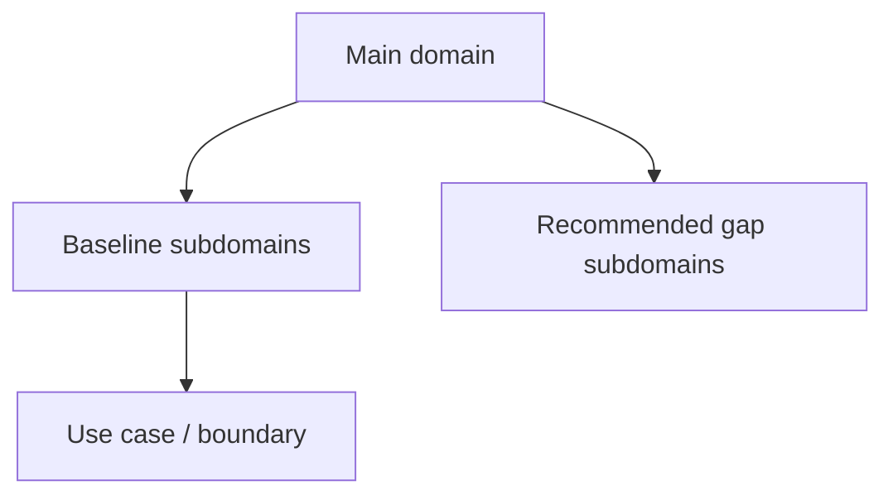
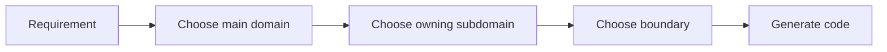

# Subdomains

本文件在本次任務限制下，僅依 Context7 驗證的 bounded context 與 strategic design 原則重建，不主張反映現況實作。

## Main Domain Inventory

| Main Domain | Baseline Subdomains | Recommended Gap Subdomains |
|---|---|---|
| workspace | audit, feed, scheduling, workflow | lifecycle, membership, sharing, presence |
| platform | identity, account, account-profile, organization, access-control, security-policy, platform-config, feature-flag, onboarding, compliance, billing, subscription, referral, integration, workflow, notification, background-job, content, search, audit-log, observability, analytics, support | tenant, entitlement, secret-management, consent |
| notion | knowledge, authoring, collaboration, database, ai, analytics, attachments, automation, integration, notes, templates, versioning | taxonomy, relations, publishing |
| notebooklm | ai, conversation, note, notebook, source, synthesis, versioning | ingestion, retrieval, grounding, evaluation |

## Strategic Notes

- baseline subdomains 代表本架構基線中已確立的核心切分。
- recommended gap subdomains 代表依 Context7 推導出的合理補洞方向。
- recommended gap subdomains 不等於已驗證現況實作。

## Ownership Summary

- workspace 關心協作範疇。
- platform 關心治理與權益。
- notion 關心正典知識內容。
- notebooklm 關心推理與衍生輸出。

## Subdomain Anti-Patterns

- 不把 baseline subdomains 與 recommended gap subdomains 混成同一種事實狀態。
- 不把主域缺口直接分攤到別的主域，造成所有權漂移。
- 不把子域名稱當成 UI 功能清單，而忽略其邊界責任。

## Copilot Generation Rules

- 生成程式碼時，先確認需求屬於哪個主域與子域，再決定實作位置。
- 奧卡姆剃刀：能放進既有子域就不要創造新子域；能放進既有 use case 就不要新增第二條平行流程。
- gap subdomain 只表示架構缺口，不表示一定要立刻實作。

## Dependency Direction Flow

## Correct Interaction Flow

## Document Network

- [architecture-overview.md](./architecture-overview.md)
- [bounded-contexts.md](./bounded-contexts.md)
- [contexts/workspace/subdomains.md](./contexts/workspace/subdomains.md)
- [contexts/platform/subdomains.md](./contexts/platform/subdomains.md)
- [contexts/notion/subdomains.md](./contexts/notion/subdomains.md)
- [contexts/notebooklm/subdomains.md](./contexts/notebooklm/subdomains.md)