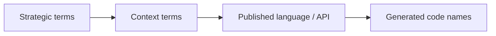
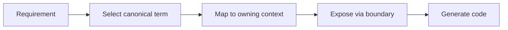

# Ubiquitous Language

本文件在本次任務限制下，僅依 Context7 驗證的 DDD ubiquitous language 原則重建，不主張反映現況實作。

## Strategic Terms

| Term | Meaning |
|---|---|
| Main Domain | 戰略層級的主要 bounded context 群組 |
| Bounded Context | 一組高凝聚、可自洽的語言與規則邊界 |
| Published Language | 跨邊界交換時使用的共同語言 |
| Upstream | 關係中提供語言或能力的一方 |
| Downstream | 關係中消費語言或能力的一方 |
| Anti-Corruption Layer | downstream 用來保護本地語言的轉譯層 |
| Conformist | downstream 直接接受 upstream 語言的整合選擇 |
| Shared Kernel | 對稱共用模型關係 |
| Partnership | 對稱共同成功 / 共同失敗關係 |
| Account Scope | shell 中由 `accountId` 表示的帳號範疇；代碼中的 `AccountType = "user" | "organization"` 會把它映射成 personal account 或 organization account 語意 |
| Workspace Scope | 由 `workspaceId` 表示的協作容器範疇，必須從屬於某個 account scope |
| Canonical Route Contract | 只用來表達 composition surface 的正典 URL 形狀，不取代 published language |

## Domain Terms

| Domain | Key Terms |
|---|---|
| platform | Actor, Tenant, Entitlement, Consent, Secret |
| workspace | Workspace, Membership, ShareScope, ActivityFeed, AuditTrail |
| notion | KnowledgeArtifact, Taxonomy, Relation, Publication |
| notebooklm | Notebook, Ingestion, Retrieval, Grounding, Synthesis, Evaluation |

## Route Composition Terms

| Term | Meaning |
|---|---|
| accountId | shell route 上的 account scope identifier，不等於 workspaceId，也不直接等於 Tenant 語言 |
| workspaceId | workspace scope identifier；在 canonical shell URL 中作為 account scope 之下的第二段 |
| AccountType String Contract | code-level enum `"user" | "organization"`；`"user"` 對應 personal actor account，`"organization"` 對應 organization account |
| Personal Account | `AccountType = "user"` 對應的 personal actor account 語意 |
| Organization Account | `AccountType = "organization"` 對應的 organization account 語意 |
| Canonical Workspace URL | `/{accountId}/{workspaceId}` |
| Legacy Workspace Redirect Surface | `/{accountId}/workspace/{workspaceId}` |
| Legacy Organization Redirect Surface | `/{accountId}/organization/*` |

## Context Map Alignment

| Relationship | Published Language Tokens | Upstream Term Source | Downstream Local Terms |
|---|---|---|---|
| platform -> workspace | actor reference, organization scope, access decision, entitlement signal | Actor, Tenant, Entitlement, Consent | Workspace, Membership, ShareScope |
| platform -> notion | actor reference, organization scope, access decision, entitlement signal, ai capability signal | Actor, Tenant, Entitlement, Secret | KnowledgeArtifact, Taxonomy, Relation, Publication |
| platform -> notebooklm | actor reference, organization scope, access decision, entitlement signal, ai capability signal | Actor, Tenant, Entitlement, Secret | Notebook, Ingestion, Retrieval, Grounding, Synthesis, Evaluation |
| workspace -> notion | workspaceId, membership scope, share scope | Workspace, Membership, ShareScope | KnowledgeArtifact, Taxonomy, Relation |
| workspace -> notebooklm | workspaceId, membership scope, share scope | Workspace, Membership, ShareScope | Notebook, Retrieval, Grounding, Synthesis |
| notion -> notebooklm | knowledge artifact reference, attachment reference, taxonomy hint | KnowledgeArtifact, Taxonomy, Relation | Notebook, Retrieval, Grounding, Synthesis, Evaluation |

## Published Language Token Glossary

| Token | Canonical Mapping | Notes |
|---|---|---|
| actor reference | Actor | 不以 User 泛稱，避免與 Membership 混名 |
| organization scope | Tenant / Organization scope | 用於治理邊界，不等於 Workspace scope |
| access decision | Access-Control / Security-Policy result | 僅傳遞判定結果，不暴露內部 policy 模型 |
| entitlement signal | Entitlement / Subscription capability signal | 不混同 feature-flag payload |
| ai capability signal | platform.ai shared capability signal | notion 與 notebooklm 僅消費，不擁有 generic `ai` 子域 |
| workspaceId | Workspace identifier | 不取代 knowledge/notebook 的本地主鍵 |
| membership scope | Membership constraint | 不混同 Actor 身份語言 |
| share scope | ShareScope constraint | 不混同一般 permission 欄位集合 |
| knowledge artifact reference | KnowledgeArtifact reference | 僅引用，不代表內容所有權轉移 |
| attachment reference | Attachment reference | 提供可追溯引用，不暴露儲存實作 |
| taxonomy hint | Taxonomy hint | 作為推理輔助語言，不覆蓋 notion 正典 taxonomy |

## Naming Rules

- 不用 User 混指 Actor 與 Membership。
- 不用 Plan 混指 Subscription 與 Entitlement。
- 不用 Wiki 混指 KnowledgeArtifact。
- 不用 Chat 混指 Conversation。
- 不用 Search 混指 Retrieval。
- 不用 AI 混指 platform 的 shared AI capability 與 notion / notebooklm 的本地 use case。
- 不用 Analytics 混指 platform analytics 與 notion 的 knowledge-analytics。
- 不用 Integration 混指 platform integration 與 notion 的 knowledge-integration。
- 不用 Versioning 混指 notion 的 knowledge-versioning 與 notebooklm 的 conversation-versioning。
- 不用 Workflow 混指 platform workflow 與 workspace-workflow。
- 不用 accountId 混指 workspaceId。
- 不用 `AccountType = "personal"` 取代 `AccountType = "user"`。
- 不用 `/{accountId}/workspace/{workspaceId}` 當成新的 canonical workspace URL。
- 不用 `/{accountId}/organization/*` 當成新的 canonical governance route。

## Naming Anti-Patterns

- 用同一個詞同時代表平台治理語言與工作區參與語言。
- 用內容產品舊名覆蓋 notion 的正典語言。
- 用 Search 混指 notebooklm 的 Retrieval 與一般搜尋能力。
- 用同一個 generic 子域名跨主域重複宣稱所有權，再期望 Copilot 自行猜對上下文。
- 把 route composition contract 誤寫成 cross-context published language。
- 把 personal account 顯示語言誤當成 code-level `AccountType` literal。
- 把 legacy redirect surface 誤寫成正典 URL 契約。

## Copilot Generation Rules

- 生成程式碼時，先對齊 strategic term，再對齊 context-specific term，最後才命名型別與 API。
- 奧卡姆剃刀：若一個詞已足夠準確，就不要再加第二個近義詞製造歧義。
- 名稱衝突時先回到 glossary，而不是直接在程式碼裡各自命名。

## Dependency Direction Flow

## Correct Interaction Flow

## Document Network

- [contexts/workspace/ubiquitous-language.md](./contexts/workspace/ubiquitous-language.md)
- [contexts/platform/ubiquitous-language.md](./contexts/platform/ubiquitous-language.md)
- [contexts/notion/ubiquitous-language.md](./contexts/notion/ubiquitous-language.md)
- [contexts/notebooklm/ubiquitous-language.md](./contexts/notebooklm/ubiquitous-language.md)
- [bounded-context-subdomain-template.md](./bounded-context-subdomain-template.md)
- [project-delivery-milestones.md](./project-delivery-milestones.md)
- [decisions/0004-ubiquitous-language.md](./decisions/0004-ubiquitous-language.md)

## Conflict Resolution

- 若 strategic term 與主域 term 衝突，優先維持主域語言不被污染，再回寫 strategic glossary。
- 若同一個詞在多主域都想擁有，優先看它服務的是治理、協作範疇、正典內容還是推理輸出。