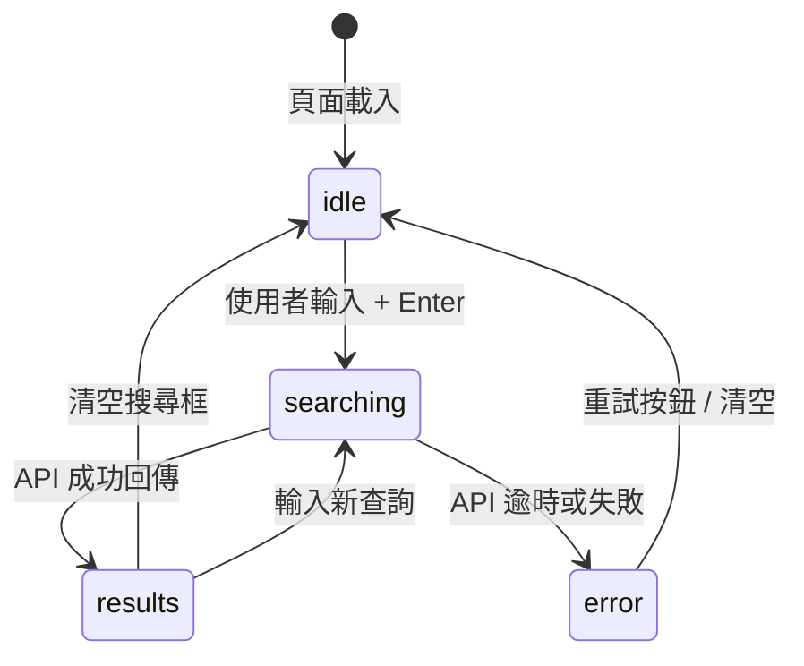

# Wiki 知識中樞 UI/UX 設計規格

> **文件版本**：v1.0.0
> **最後更新**：2026-03-20
> **目標讀者**：前端工程師、設計師、UI 審查員

---

## 0. 設計原則

| 原則 | 說明 |
|------|------|
| **知識入口一致性** | Wiki 側邊欄是唯一的知識瀏覽入口；不另開知識 tab 或彈出視窗 |
| **漸進揭露** | 首屏僅顯示摘要；完整資訊透過展開或點擊觸達 |
| **RAG 優先** | 搜尋入口始終可見，搜尋意圖先於瀏覽意圖 |
| **狀態明確** | 每個知識文件的 pipeline 狀態（uploaded / processing / ready / error）必須肉眼可辨識 |
| **無跳頁知識** | 組織知識、工作區知識、Wiki 頁面皆在同一 wiki 路由下，不另行跳轉至其他 routes |

---

## 1. 整體版型

### 1.1 頁面布局結構

```
┌────────────────────────────────────────────────────────────┐
│  AppRail（左側圖示導覽）                                    │
│  ┌──────────────┬───────────────────────────────────────┐  │
│  │ DashboardSidebar│         Main Content                │  │
│  │  (280px fixed) │                                      │  │
│  │  Wiki 側邊欄   │   [依選取節點呈現對應內容]            │  │
│  │               │                                      │  │
│  │               │                                      │  │
│  └──────────────┴───────────────────────────────────────┘  │
└────────────────────────────────────────────────────────────┘
```

### 1.2 Wiki 進入路由

| 路由 | 對應內容 |
|------|----------|
| `/wiki` | Wiki 主頁（RAG 搜尋入口 + 組織知識總覽） |
| `/wiki?section=org` | 組織知識庫 |
| `/wiki?section=workspace&id={wsId}` | 指定工作區知識 |
| `/wiki?page={pageId}` | 指定 Wiki 頁面 |
| `/wiki?archived=true` | 封存列表 |

---

## 2. Wiki 側邊欄（DashboardSidebar 內）

### 2.1 側邊欄結構

```
Wiki 側邊欄
│
├── 🔍 RAG 搜尋框（頂部，始終可見）
│   └── 快捷鍵：⌘K 或 Ctrl+K 聚焦
│
├── 📌 首頁
│
├── 🏢 組織知識庫
│   ├── 文件總數徽章（例：42 份）
│   ├── 就緒率（例：38/42 就緒）
│   └── [分類列表]
│       ├── 規章制度 (12)
│       ├── 技術文件 (8)
│       └── ...
│
├── 🗂️ 工作區知識
│   ├── [工作區 A] (10 份 ✅)
│   │   └── 文件清單（摺疊）
│   ├── [工作區 B] (3 份 ⚠️ 2 份處理中)
│   └── ...
│
├── 📝 Wiki 頁面
│   ├── 共用頁面
│   │   ├── 產品規格書
│   │   └── 入職指南
│   └── 私人頁面
│       └── 我的草稿
│
└── 🗑️ 封存（預設折疊）
```

### 2.2 側邊欄元件狀態

| 狀態 | 視覺表現 |
|------|----------|
| `loading` | skeleton 佔位符（每個 section 顯示 2–3 行灰色佔位） |
| `loaded` | 完整節點渲染，包含徽章計數 |
| `error` | 顯示「⚠️ 無法載入知識節點」，保留 section 標題 |
| `empty` | 顯示 CTA：例如「＋ 新增頁面」按鈕 |
| `collapsed` | DashboardSidebar 寬度 = 0（layout.tsx 控制） |

### 2.3 搜尋框行為

| 行為 | 規格 |
|------|------|
| 焦點觸發 | ⌘K / Ctrl+K |
| Placeholder | `搜尋知識庫...（按 / 或 ⌘K 開始）` |
| 搜尋結果呈現 | inline dropdown（最多 5 筆摘要 + 「查看全部結果」連結） |
| 空搜尋結果 | 「找不到相關內容，換個問法試試？」 |
| 搜尋延遲 | debounce 300ms；顯示 spinner 直到結果回傳 |

---

## 3. 組織知識庫主頁

### 3.1 版面結構

```
┌─────────────────────────────────────────────────┐
│  組織知識庫                                      │
│  [全組織 42 份文件] [38 就緒] [2 處理中] [2 錯誤] │
│                                                  │
│  ┌───────────────────────────────────────────┐   │
│  │ 🔍  向知識庫提問（RAG 搜尋入口）           │   │
│  └───────────────────────────────────────────┘   │
│                                                  │
│  分類瀏覽                                        │
│  ┌──────────┐ ┌──────────┐ ┌──────────┐         │
│  │ 規章制度  │ │ 技術文件  │ │ 產品手冊  │         │
│  │  12 份   │ │   8 份   │ │   6 份   │         │
│  └──────────┘ └──────────┘ └──────────┘         │
│                                                  │
│  最近更新                                        │
│  ─────────────────────────────────────────────  │
│  [文件卡片列表]                                   │
└─────────────────────────────────────────────────┘
```

### 3.2 KPI 卡片規格

| 指標 | 欄位來源 | 格式 |
|------|----------|------|
| 文件總數 | `WorkspaceKnowledgeSummary.registeredAssetCount`（跨工作區加總） | `{n} 份` |
| 就緒數 | `readyAssetCount` | `{n} 就緒` |
| 就緒率 | `readyAssetCount / registeredAssetCount * 100` | `{n}%`（圓形進度環） |
| 支援來源數 | `supportedSourceCount` | `{n} 種來源` |

### 3.3 文件卡片（DocumentRow）

| 欄位 | 規格 |
|------|------|
| 文件名稱 | `title`（最多 2 行，超出 ellipsis） |
| 狀態徽章 | `uploaded` 灰 / `processing` 藍+spinner / `ready` 綠 / `error` 紅 |
| Taxonomy 標籤 | `taxonomy.category`（Badge，最多 1 個 category + 2 個 tags） |
| 工作區來源 | `workspaceId` 映射的工作區名稱（灰色） |
| 最後更新 | 相對時間（例：3 小時前） |
| 動作 | 三點選單：檢視 / 重新索引 / 封存 |

---

## 4. 工作區知識頁

### 4.1 版面結構

```
┌─────────────────────────────────────────────────┐
│  工作區：{workspaceName}                         │
│  ─────────────────────────────────────────────  │
│  知識健康 ● 就緒  [10 份文件]  [10/10 就緒]      │
│                                                  │
│  [健康指標卡（KpiCard）]                          │
│                                                  │
│  文件清單                                        │
│  ─────────────────────────────────────────────  │
│  [DocumentRow × n]                              │
│                                                  │
│  ＋ 上傳新文件                                   │
└─────────────────────────────────────────────────┘
```

### 4.2 知識健康狀態 Badge

| `status` | 顏色 | 文字 |
|----------|------|------|
| `needs-input` | 灰色（muted） | ⚪ 尚無資料 |
| `staged` | 琥珀色 | 🟡 部分就緒 |
| `ready` | 綠色 | 🟢 就緒 |

### 4.3 文件版本歷史區塊

當展開文件卡片時，顯示版本紀錄（目前為 stub，待 `IVersionHistoryRepository` 實作）：

```
版本歷史
  v2  2026-03-20  [當前版本]  uploaded by John
  v1  2026-03-01             uploaded by Jane
```

---

## 5. Wiki 頁面（WikiPageView）

### 5.1 頁面版面

```
┌─────────────────────────────────────────────────┐
│  [← 返回]  {breadcrumb}                          │
│                                                  │
│  {pageTitle}                              [⋮ 更多]│
│  ─────────────────────────────────────────────  │
│  範圍：🏢 組織  |  最後編輯：John 3 天前          │
│                                                  │
│  {Markdown 內容}                                 │
│                                                  │
│                                                  │
│  ─────────────────────────────────────────────  │
│  [⊕ 新增子頁面]                                  │
└─────────────────────────────────────────────────┘
```

### 5.2 頁面動作（三點選單）

| 動作 | 條件 | 說明 |
|------|------|------|
| 編輯 | isOwner 或 Admin | 開啟 markdown 編輯模式 |
| 複製連結 | 任何人 | 複製頁面 URL 至剪貼板 |
| 封存 | isOwner 或 Admin | 標記為封存（reversible） |
| 還原 | isOwner 或 Admin（封存狀態） | 解除封存 |
| 刪除 | Admin only | 永久刪除（需二次確認） |

### 5.3 頁面範圍（Scope）徽章

| scope | 圖示 | 文字 |
|-------|------|------|
| `organization` | 🏢 | 組織共用 |
| `workspace` | 🗂️ | 工作區：{workspaceName} |
| `private` | 🔒 | 私人 |

---

## 6. RAG 搜尋結果頁

### 6.1 版面結構

```
┌─────────────────────────────────────────────────┐
│  🔍 搜尋：「員工請假規定」               [✕ 關閉]│
│  ─────────────────────────────────────────────  │
│                                                  │
│  AI 回答                                         │
│  ┌─────────────────────────────────────────┐    │
│  │ 根據貴組織的規章制度，員工每年享有...       │    │
│  │                                         │    │
│  │ 引用來源：                               │    │
│  │  [1] 人事規章制度 v3, 第 4 節            │    │
│  │  [2] 2024 勞工法規摘要, p.12            │    │
│  └─────────────────────────────────────────┘    │
│                                                  │
│  相關文件                                        │
│  ─────────────────────────────────────────────  │
│  [DocumentRow × 3]（依相關度排序）               │
└─────────────────────────────────────────────────┘
```

### 6.2 搜尋狀態機



### 6.3 搜尋回應時間 SLO

| 指標 | 目標值 |
|------|--------|
| P50 回應時間 | ≤ 1.5 秒 |
| P95 回應時間 | ≤ 5 秒 |
| 逾時閾值 | 10 秒後顯示「搜尋超時，請稍後再試」 |

---

## 7. 互動模式

### 7.1 空狀態 CTA

| 空狀態位置 | 呈現元素 |
|------------|----------|
| 組織知識庫（無文件） | 「尚無知識文件。點擊上傳第一份文件 →」 |
| 工作區知識（無文件） | 「此工作區尚未上傳任何知識文件。」 + ＋ 上傳 |
| Wiki 頁面（無共用頁面） | 「尚無共用頁面。建立第一個頁面開始協作 →」 |
| 封存列表（無封存） | 「沒有封存的頁面或文件。」 |

### 7.2 加載骨架（Skeleton）

所有知識卡片在資料加載期間顯示 2 行灰色矩形 skeleton，避免內容閃爍（CLS）。

### 7.3 Optimistic UI 規格

| 操作 | Optimistic 行為 |
|------|-----------------|
| 建立 Wiki 頁面 | 立即在側邊欄插入新節點，loading spinner，失敗時 rollback |
| 封存頁面 | 立即從列表移除，undo toast（5 秒），逾時確認 |
| 上傳文件 | 立即顯示 `status: uploaded` 卡片，pipeline 狀態即時更新（Firestore `onSnapshot`） |

---

## 8. 無障礙（Accessibility）

| 規格 | 標準 |
|------|------|
| 鍵盤導航 | 側邊欄完全可用 Tab / Enter / Space / Esc 操作 |
| 螢幕閱讀器 | 所有 icon button 有 `aria-label`；動態 badge 有 `aria-live="polite"` |
| 色彩對比 | 狀態徽章文字與背景對比 ≥ 4.5:1（WCAG AA） |
| Focus visible | 所有互動元素有可見 focus ring（Tailwind `focus-visible:ring-2`） |
| 圖片 Alt | Wiki 封面圖片必須有 `alt` 屬性 |

---

## 9. 響應式行為

| 斷點 | 行為 |
|------|------|
| `lg`（≥1024px） | DashboardSidebar 展開（280px）+ 主內容區並排 |
| `md`（768–1023px） | DashboardSidebar 折疊（width=0）；漢堡選單觸發 |
| `sm`（<768px） | DashboardSidebar 以 drawer 方式覆蓋主內容 |

---

## 10. 目前已上線的 UI 表面

| UI 表面 | 位置 | 狀態 |
|---------|------|------|
| Wiki 主頁（stub） | `app/(shell)/wiki/page.tsx` | ✅ 已上線（stub，無真實資料） |
| WorkspaceWikiTab | `modules/workspace/interfaces/components/WorkspaceWikiTab.tsx` | ✅ 已上線（KpiCard + DocumentRow） |
| RAG 搜尋框 | `app/(shell)/wiki/page.tsx` 內 stub | ✅ UI 框架就緒，搜尋邏輯待接 |
| Wiki 側邊欄 | DashboardSidebar 靜態節點 | ✅ 已上線（靜態，無動態資料） |
| WikiSidebar 動態元件 | `modules/wiki/interfaces/components/WikiSidebar.tsx` | 🔲 尚未實作 |
| 知識文件上傳流程 | 需 `modules/wiki` 建立後串接 | 🔲 尚未實作 |
| RAG 回答結果頁 | 需 Genkit flow + RAG use-case | 🔲 尚未實作 |

---

## 11. 設計系統參考

| 元件 | shadcn/ui 對應 |
|------|---------------|
| 側邊欄節點 | `SidebarSection` / `SidebarLeaf`（自定義，參考現有 wiki/page.tsx） |
| 狀態徽章 | `Badge`（variant: default / secondary / destructive / outline） |
| 文件卡片 | 自定義 `DocumentRow`（參考 WorkspaceWikiTab 實作） |
| KPI 卡片 | 自定義 `KpiCard`（參考 WorkspaceWikiTab 實作） |
| 搜尋輸入框 | `Input` + `Command`（shadcn Command/Palette 模式） |
| 對話確認 | `AlertDialog`（封存 / 刪除操作） |
| Toast 通知 | `Sonner`（操作回饋） |
| Loading skeleton | `Skeleton`（shadcn） |

---

## 12. 相關文件

| 文件 | 路徑 |
|------|------|
| Wiki 架構規範 | `docs/architecture/wiki.md` |
| Wiki 開發契約 | `docs/reference/development-contracts/wiki-contract.md` |
| Wiki 開發指南 | `docs/wiki/development-guide.md` |
| Wiki 使用手冊 | `docs/wiki/user-manual.md` |

---

## 13. 變更記錄

| 版本 | 日期 | 說明 |
|------|------|------|
| v1.0.0 | 2026-03-20 | 初版：Wiki UI/UX 設計規格，涵蓋整體版型、側邊欄、搜尋、組織知識庫、工作區知識、RAG 搜尋結果、無障礙、響應式 | xuanwu-app 設計委員會 |
