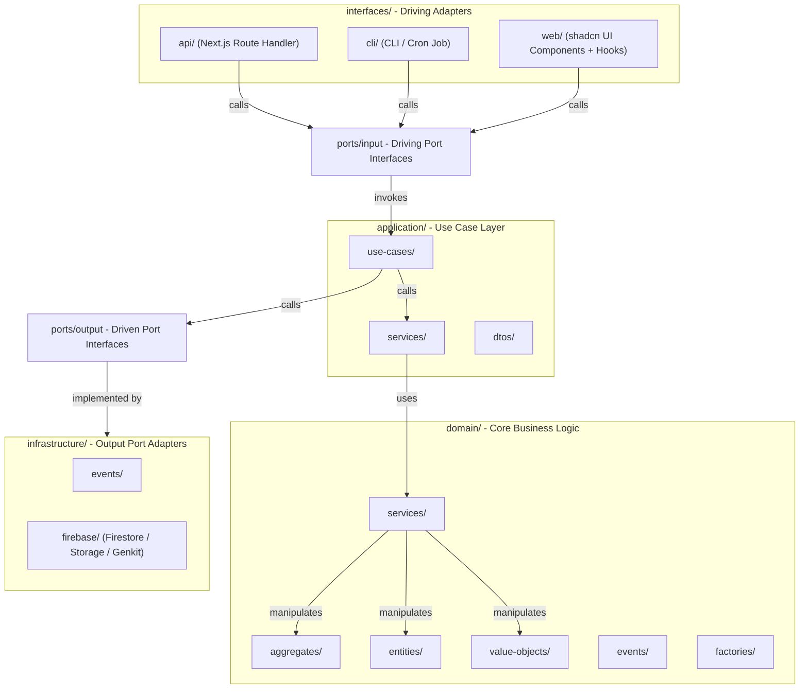

# workspace — 協作容器上下文

> **Domain Type:** Generic Subdomain  
> **模組路徑:** `modules/workspace/`  
> **定位:** 協作範圍、生命週期與工作區公開邊界

> **文件優先原則：** 先用本文件與 companion docs 定義目標結構，再用文件去壓代碼收斂。

## Strategic Role

`workspace` 是 Xuanwu 的協作容器 bounded context。它提供工作區作為協作範圍的 identity、生命週期與可見性語言，讓知識、來源、工作流、稽核、動態與排程等上下文可以用同一個 `workspaceId` 對齊範圍。

從戰略分類看，workspace 所對應的問題空間屬於 generic subdomain，不是產品差異化核心；真正差異化的知識內容、檢索與協作語意由其他 bounded context 擁有。

從邊界落地看，`modules/workspace/` 是承載這組 generic-subdomain 語言的 bounded context，而不是整個 Xuanwu domain 的總模型。

## Domain / Subdomain / Bounded Context

| 層級 | workspace 在此層級的角色 |
|---|---|
| Domain | Xuanwu 這個整體知識平台業務域 |
| Subdomain | 協作容器與範圍治理問題空間，戰略上屬於 generic subdomain |
| Bounded Context | `modules/workspace/`，承載 `workspaceId`、生命週期、可見性與工作區公開邊界 |

這裡描述的是以 workspace 為中心的 selected view。它用來分析此問題空間牽涉到哪些 subdomains 與 bounded contexts，不等於整個 Xuanwu domain 的完整戰略地圖。

## 主要職責

| 能力 | 說明 |
|---|---|
| Workspace 容器生命週期 | 建立工作區、更新設定、管理 `preparatory | active | stopped` 狀態 |
| 協作範圍語言 | 提供 `workspaceId`、`WorkspaceVisibility` 與工作區範圍識別語言 |
| 工作區公開邊界 | 透過 `interfaces/api/` 暴露穩定查詢、命令入口與 UI composition surface |
| Read-side Projections | 組合工作區成員檢視與工作區導覽節點等查詢模型 |

## 標準資料夾結構

```txt
modules/workspace/
├── domain/                     ← 核心業務邏輯
│   ├── aggregates/             ← 聚合根
│   ├── entities/               ← Entity / Value Object
│   ├── value-objects/
│   ├── events/                 ← Domain Events
│   ├── factories/              ← Domain Factories
│   └── services/               ← Domain Services（純業務邏輯）
│
├── application/                ← Use Case 層
│   ├── dtos/                   ← Input / Output DTO
│   ├── services/               ← Application Services（協調 Use Case 流程）
│   └── use-cases/              ← 單一 Use Case（呼叫 Domain Services + Output Ports）
│
├── ports/                      ← Hexagonal Ports
│   ├── input/                  ← Driving Ports（供 UI / API / CLI 呼叫）
│   └── output/                 ← Driven Ports（Repository / External Service 抽象）
│
├── infrastructure/             ← Adapters / Output Port 實作
│   ├── events/                 ← Event Dispatcher / PubSub 實作
│   └── firebase/               ← Firestore / Storage / Genkit Adapter
│
└── interfaces/                 ← Driving Adapters（外部入口）
	├── api/                    ← Next.js Route Handler → Input Port
	├── cli/                    ← CLI / Cron Job → Input Port
	└── web/                    ← shadcn UI Components + Hooks → Input Port
```

## 不屬於此 Context 的責任

- `organization` 擁有組織成員、團隊與組織治理真相來源
- `knowledge` / `knowledge-base` / `source` / `notebook` 擁有內容與知識工作流語意
- `shared` 擁有跨 bounded context 的事件基底與 event publishing 基礎設施
- UI tab 組裝屬於 interface composition，不等於 context map

## Tactical Model Summary

| 類型 | 目前契約 |
|---|---|
| Aggregate Root | `Workspace` |
| Supporting Domain Objects | `WorkspaceLocation`、`Capability`、`WorkspaceGrant`、`WorkspacePersonnel` |
| Read Projections | `WorkspaceMemberView`、`WikiAccountContentNode`、`WikiWorkspaceContentNode` |
| Drivers | Browser UI、Route Handler、CLI / Cron、其他 bounded context 經由 `interfaces/api/` 的呼叫者 |
| Driving Adapters | `interfaces/api/`、`interfaces/cli/`、`interfaces/web/` |
| Driving Ports | `ports/input/` |
| Application Layer | `application/use-cases/`、`application/services/`、`application/dtos/` |
| Driven Ports | `ports/output/` |
| Driven Adapters | `infrastructure/firebase/`、`infrastructure/events/` |
| Write-side Port | `WorkspaceRepository` |
| Read-side Ports | `WorkspaceQueryRepository`、`WikiWorkspaceRepository` |
| Domain Services | `domain/services/`，承載不自然屬於 aggregate 的純規則 |
| Domain Events | `WorkspaceCreated`、`WorkspaceLifecycleTransitioned`、`WorkspaceVisibilityChanged` 為目標契約 |

## Hexagonal View

| 六邊形位置 | workspace 對位 |
|---|---|
| Domain Model Core | `domain/` 下的 aggregates、entities、value-objects、events、factories、services |
| Application Ring | `application/use-cases/`、`application/services/`、`application/dtos/` |
| Driving Adapters | `interfaces/api/`、`interfaces/cli/`、`interfaces/web/` |
| Driving Ports | `ports/input/` |
| Driven Ports | `ports/output/` |
| Driven Adapters | `infrastructure/events/`、`infrastructure/firebase/` |

## Dependency Diagram



### 說明

1. Interfaces -> Input Ports -> Use Cases -> Application Services -> Domain Services -> Domain Models：驅動流程完全向內。
2. Use Cases -> Output Ports -> Infrastructure：外部資源由 Output Port 抽象，Infrastructure 實作。
3. Domain Services / Domain Models 不依賴 Application 或 Infrastructure。
4. `web/`、`api/`、`cli/` 只做外部驅動與 DTO 轉換，不直接做 domain 決策。

`context-map.md` 描述的是 bounded context 在整體 domain 裡的外部關係；六邊形描述的是這個 bounded context 內部的結構。兩者不可混用。

若 workspace 透過事件與其他 bounded contexts 協作，它仍然是一個位於整體 event-driven topology 中的 hexagon：commands / queries 由 driving side 進入，domain events 由內核語言產生，再由外層 adapter 發布。

## DDD 概念導讀

| 概念 | 在 workspace 中的程式型態 | 主要查看文件 |
|---|---|---|
| Entity（實體） | 類別 / 物件 | `aggregates.md` |
| Value Object（值對象） | 類別 / 物件 | `aggregates.md`、`ubiquitous-language.md` |
| Aggregate / Aggregate Root（聚合 / 聚合根） | 類別 / 物件 | `aggregates.md` |
| Repository（倉儲） | 介面或類別（負責資料存取） | `repositories.md` |
| Ports（端口） | 介面，宣告 collaboration seam | `repositories.md`、`application-services.md` |
| Adapters（適配器） | 類別 / 函式 / 模組，連接 drivers 或外部系統 | `bounded-context.md`、`repositories.md`、`application-services.md` |
| 外部系統 / Driver（驅動器） | 從外部啟動此 bounded context 的角色或系統 | `bounded-context.md`、`context-map.md` |
| Projection / Read Model | 查詢導向的讀取模型 | `aggregates.md`、`application-services.md`、`ubiquitous-language.md` |
| Domain Service（領域服務） | 類別 / 函式 | `domain-services.md` |
| Factory（工廠） | 類別 / 函式 | `application-services.md`、`domain-events.md` |
| Domain Event（領域事件） | 事件類別、訊息物件 | `domain-events.md`、`context-map.md` |

## 實作備註

- 目前程式中仍有一些 supporting records 與 read projections 混置於 `domain/entities/`；本文件定義的是收斂方向
- `WorkspaceMemberView` 與 `WikiContentTree` 型別不得再被描述成 aggregate 或 value object
- 這份 README 以 `interfaces/api/`、`ports/input/`、`ports/output/` 為文件基線，後續代碼應向此結構收斂
- `WorkspaceMemberView` 與 `WikiContentTree` 型別不得再被描述成 aggregate 或 value object

## 詳細文件

| 文件 | 說明 |
|---|---|
| [subdomain.md](./subdomain.md) | workspace 為何屬於 generic subdomain，以及哪些內容不是 subdomain 本體 |
| [bounded-context.md](./bounded-context.md) | workspace 作為 bounded context 的邊界、drivers、ports、adapters 與 read model |
| [ubiquitous-language.md](./ubiquitous-language.md) | workspace BC 的通用語言、read model 與 hexagonal 元術語 |
| [aggregates.md](./aggregates.md) | aggregate、entity、value object 與 read model / projection 對位 |
| [application-services.md](./application-services.md) | application layer use cases、drivers、ports、adapters 與 read model orchestration |
| [repositories.md](./repositories.md) | driven ports、repository adapters 與 query/read model 持久化邊界 |
| [domain-services.md](./domain-services.md) | domain service 與 ports/adapters/drivers/read models 的區別 |
| [domain-events.md](./domain-events.md) | workspace 領域事件契約、事件驅動整合與 projection 關係 |
| [context-map.md](./context-map.md) | workspace 與其他 bounded context 的 integration patterns |
